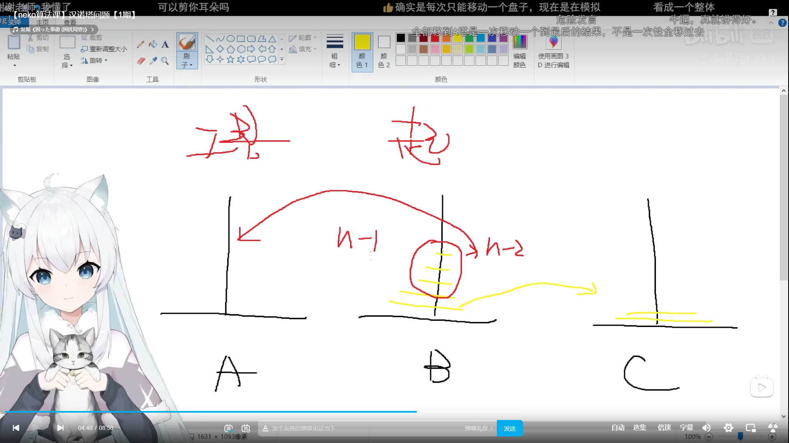

这节课的内容非常关键！“程序 = 数据 + 算法”是编程最本质的公式。变量（数据）和类型构成了夜雀食堂的食材与账本，而方法（算法）则是米斯琪烹饪料理和处理突发状况的逻辑。

特别是你提到的**递归（Recursion）**，它是很多初学者觉得玄乎的地方。为了帮你彻底攻克它，我为你设计了三个循序渐进的实战案例，重点放在递归的深度体验上：

### 案例一：基本元素与三种方法的运用——“居酒屋收银台”
**学习目标**：掌握数据类型、`var` 关键字、注释规范，以及熟练编写三种不同签名的方法。
**世界观设定**：客人结账时，我们需要处理账单数据，计算总价，并打印收据。

**练习任务**：
1. **声明变量**：使用 `var` 推断类型声明几个变量，例如 `var dishName = "烤八目鳗";`，然后用 `Console.WriteLine(dishName.GetType().Name);` 验证它的类型。
2. **编写三种方法**：在 `Cashier` 类中实现以下逻辑：
   - *有输入无返回值*：`PrintReceipt(string customerName)`，负责在控制台打印欢迎语和顾客名字。
   - *无输入有返回值*：`GetTaxRate()`，返回一个固定的税率（如 `0.1`）。
   - *有输入有返回值*：`CalculateTotal(double price, int quantity)`，接收单价和数量，结合税率计算出最终价格并返回。
3. **格式化代码**：写完后按下 `Ctrl+E, D`，让代码排版变得漂亮整洁。

---

### 递归的基本思想：

**拆解问题**：
- 把规模大的问题变成规模小的同类型问题。
- 规模较小的问题又不断变成规模更小的问题
- 规模小到一定程度可以直接得出他的解

**求解**：
- 由最小规模问题的解得出较大规模问题的解
- 由较大规模问题的解不断得出规模更大问题的解
- 最后得出原来问题的解

**汉诺塔问题**：

### 案例二：递归初体验——“幽谷响子的扫落叶”
**学习目标**：理解递归的核心概念：**自己调用自己**，并且必须有**终止条件（Base Case）**。
**世界观设定**：博丽神社的幽谷响子正在打扫庭院里的落叶。地上有一堆落叶，她每次只能扫走一片，然后对剩下的落叶重复这个动作，直到没有叶子为止。

**练习任务**：
1. 创建一个方法 `void SweepLeaves(int remainingCount)`。
2. **设置终止条件**：如果 `remainingCount <= 0`，打印“院子扫干净啦！”并直接 `return`（极其重要，否则会导致无限循环/栈溢出）。
3. **递归逻辑**：如果还有叶子，打印“呼哧...扫走了第 X 片叶子”，然后调用自身 `SweepLeaves(remainingCount - 1);`。
4. 在 `Main` 方法中传入数字 5，观察控制台一层层打印出扫地过程。

---

### 案例三：递归进阶挑战——“深夜特供：无限套娃洋葱汤”
**学习目标**：掌握带有**返回值**的递归运算，这是解决复杂数学或业务问题的核心。
**世界观设定**：米斯琪研发了一款神奇的“多层洋葱汤”。这款汤的制作配方是嵌套的：第一层汤需要 1 个洋葱；第二层汤需要把第一层汤作为底料，再加上 2 个洋葱；第三层汤需要第二层汤加上 3 个洋葱……以此类推。我们要计算制作 N 层汤总共需要多少个洋葱。

**练习任务**：
1. 定义方法 `int GetOnionCount(int layer)`。
2. **终止条件**：当 `layer == 1` 时，只需要 1 个洋葱，返回 `1`。
3. **递归推导**：当 `layer > 1` 时，当前层需要的洋葱数 = `当前层的编号(layer)` + `上一层汤所需的洋葱总数(GetOnionCount(layer - 1))`。
4. **调试追踪**：在 `Main` 中调用 `GetOnionCount(4)`。建议你在每一行代码前加上 `Console.WriteLine($"正在计算第 {layer} 层...");`，这样你能清晰地看到程序是如何“层层深入”再“层层返回”的。

---

