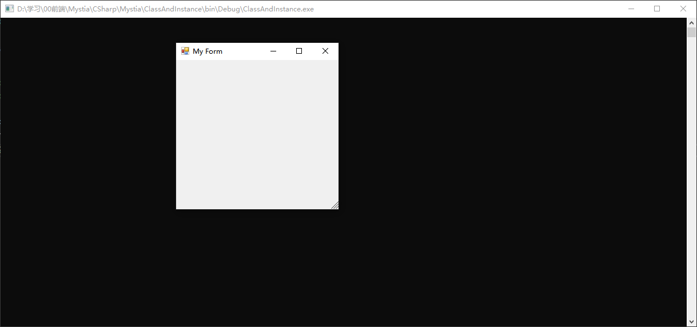

# 类，对象，类成员简介

## 1.类（class）是现实事物的模型

## 2.类与对象的关系
  - 对象也叫实例，是类经过“实例化”后得到的内存中的实体
    - 有些类不能实例化，比如“数学”（Math class），不能说“一个数学”
  - 依照类，可以创建对象，这就是实例化
    - 现实世界中常称“对象”，程序世界中常称“实例”
## 3.使用New操作符创建类的实例

程序：使用控制台程序引用命名空间 System.Windows.Forms;
form对应现实世界的“表单”这种事物。

案例：
(new Form()).ShowDialog();  --实例化

案例：
将form的标题栏设置为"My Form"

            (new Form()).Text="My Form";
            (new Form()).ShowDialog();
此时两个new实例化的form为不同的两个，所以第一个设置的Text与第二个show出来的form不相干。

            Form myForm = new Form();
            myForm.Text = "My Form";
            myForm.ShowDialog();

这里的myForm就是引用变量，可以多次使用该引用变量改变form的状态。

## 4.类的三大成员
### 属性（property）
存储数据，组合起来表示类或对象当前的状态
### 方法(Method)
由C语言中的函数（function）进化而来，表示类或对象“能做什么”
### 事件（Event）
类或对象通知其他类或对象的机制，为C#所特有（Java通过其他办法实现这个机制）
善用事件机制非常重要

### 某些特殊类或对象在成员方面侧重点不同

- 模型类或对象重在属性，如Entity Frameworl
- 工具类或对象重在方法，如Math,Console
- 通知类或对象重在事件，如各种Timer

## 5.类的静态成员与实例成员

 - 静态（static）成员在语义上表示它是“**类**的成员”
 - 实例（非静态）成员在语义表示它是“**对象**的成员”
  - 关于“绑定”（binding）——指的是编译器如何把一个成员与类或对象关联起来
    - 操作符"." ——成员访问