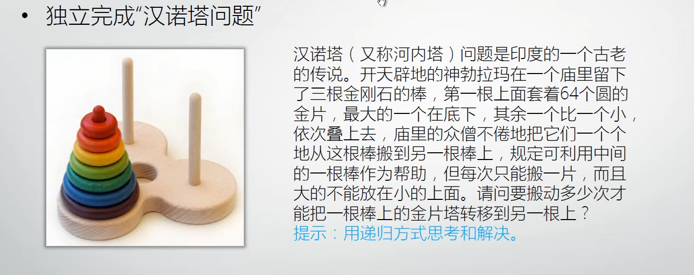

# C#语言基本元素概览，类型，变量与方法，算法简介

## 构成C#语言的基本元素

- 关键字（Keyword）
- 操作符（Operator）
- 标识符（Identifier）
- 标点符号
- 文本（字面值）
  - 整数
    - 多种后缀
  - 实数
    - 多种后缀
  - 字符
  - 字符串
  - 布尔
  - 空（null）
（以上统称标记（Token））
- 注释与空白
  - 单行
  - 多行

格式化快捷键：ctrl e,d
## 简要介绍类型、变量与方法

- 初识类型（Type）
  - 也称数据类型（Data Type）
  var声明的变量在赋值之后可以自动推断是什么类型的值。
  变量.GetType().name 可以获得变量类型名字
- 变量是存放数据的地方，简称“数据”
  - 变量的声明
  - 变量的使用
- 方法（旧称函数）是处理数据的逻辑，又称算法
  - 方法的声明
  - 方法的调用
  三种方法：
  1. 有数据输入和返回值的方法
  2. 无数据输入有返回值的方法
  3. 有数据输入无返回值的方法
- 程序=数据+算法
  - 有了变量和方法就可以写有意义的程序了

## 算法简介

- 循环
- 递归
- 汉诺塔问题：
  
