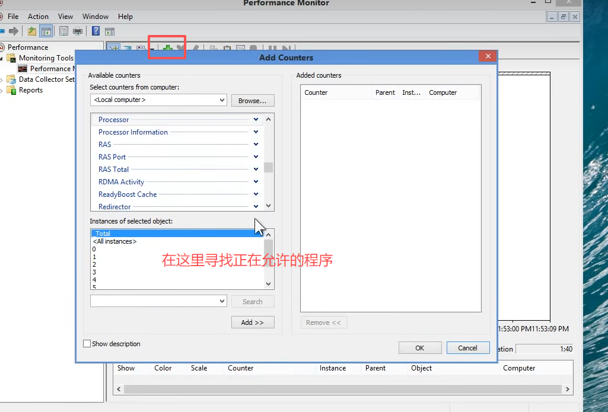
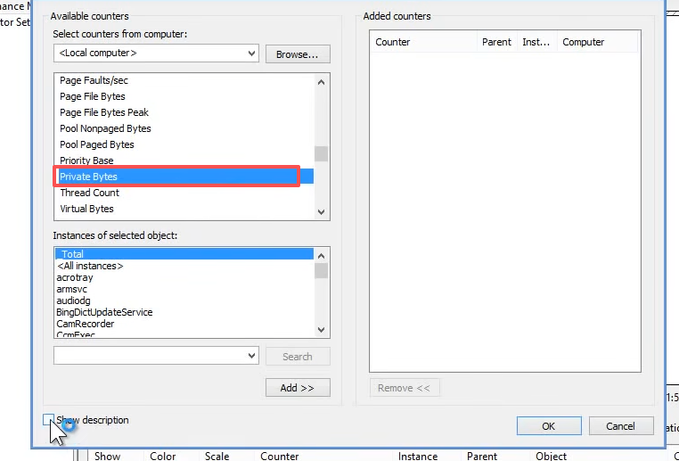
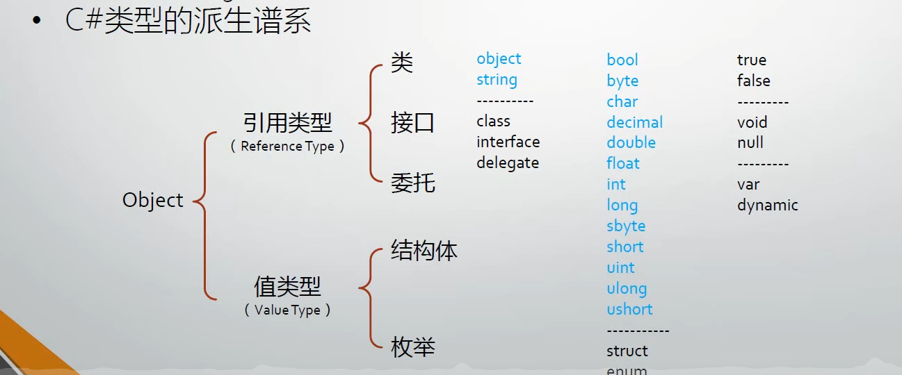
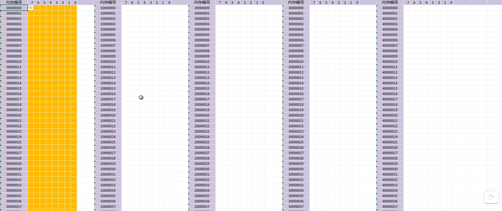

# 详解类型、变量与对象

## 什么是类型

- 又名数据类型（Data Type）
  - 数据在内存中存储时的“型号”
  - 小内存容纳大尺寸数据会丢失精确度、发生错误
  - 大内存容纳小内存数据会导致浪费
  - 编程语言的数据类型与数学的数据类型不完全相同
  
## 类型在C#语言中的作用

- 一个C#类型中所包含的信息有：
  - 存储此类型变量所需的内存空间大小
  - 此类型的值克表示的最大、最小值范围
  - 此类型所包含的成员（如方法、属性、事件等）：用GetProperties()和GetMethods()，GetEvents()可获取该类的属性、方法和事件
    ``` C# 用GetProperties()返回一个类型的方法。
             Type maType = typeof(Form);
            PropertyInfo[] properties = maType.GetProperties();
            MethodInfo[] methodInfos = maType.GetMethods();
            
            foreach (PropertyInfo property in properties)
            {
                Console.WriteLine(property.Name);
            }
            foreach (MethodInfo method in methodInfos)
            {
                Console.WriteLine(method.Name);
            }
    ```
  - 此类型由何基类派生而来：
    
  - 程序运行的时候，此类型的变量在分配在内存的什么位置
    - Stack简介
    - Stack overflow
    - Heap简介
    - 使用Performence Monitor查看进程的堆内存使用量
    - 关于内存泄漏
  
    函数调用用的栈，实例变量用堆。栈比较小，比较快，会发现栈溢出。堆很大，如果不回收会发生内存泄漏，导致内存浪费。
    使用Performance Monitor性能监视器可以看程序占用的内存情况。
    
    
    在进程（process）选项里找内存（private Bytes）
  - 此类型所允许的操作（运算）
   比如整数除法不会出现小数。

   ## C#语言的类型系统

   - C#的五大数据类型
     - 类（Classes）:如Windows,Form,Console,String
            可使用tepeof()运算符查看类型。
     - 结构体（Structures）：如Int32,Int64,Single,Double

     - 枚举(Enumerations):如HorizontalAlignment,Visibility
     - 接口（Interfaces）
     - 委托（Delegates）
   - C#派生谱系
    
    
    其中object和string是真正的数据类型。
    而class interface delegate是关键字，用于自己定义类型的。
    第二排，水蓝色是真正的struct类型，黑色是关键字用于自己定义结构体的。
    
## 变量、对象与内存

- 什么是变量：变量=以变量名所对应的内存地址为起点、以其数据类型所要求的存储空间为长度的一块内存区域。
  - 从表面上来看，变量的用途是存储数据
  - 实际上，**变量表示了存储位置，并且每个变量都有一个类型，以决定什么样的值能够存入变量**
  - 变量一共有7种
    - 静态变量，实例变量（成员变量。字段），数组元素，值参数，引用参数(ref)，输出参数（out），局部变量
  - 侠义的变量指局部变量，因为其他种类的变量都有自己的约定名称
    - 简单地讲，局部变量就是方法体（函数体）里声明的而变量
  - 变量的声明
    - 有效的修饰符组合<sub>（private public等）opt</sub> 类型 变量名 初始化器<sub>opt</sub>
  

   
  用excel表格可以表示变量在内存的结构：黄色部分代表操作系统使用的内存，不许用户使用。
  - 值类型的变量
    - 值类型没有实例，所谓的“实例”与变量合二为一
  - 引用类型的变量与实例
    - 引用类型变量与实例的关系：引用类型变量里存储的数据是对象的内存地址
    引用类型：**先分给4字节的内存**，初始都设置为0，当使用new实例化后，从堆内存创建实例，**再找一块空内存，大小为成员变量中的值类型的大小**，把内存编号转化为二进制赋值给第一次分配的4内存中。给值类型的变量存储数据。
  - 局部变量分配的是栈上的内存
  - 变量的默认值
  - 常量（值不可改变的变量）
  - 装箱与拆箱（Boxing & Unboxing）

