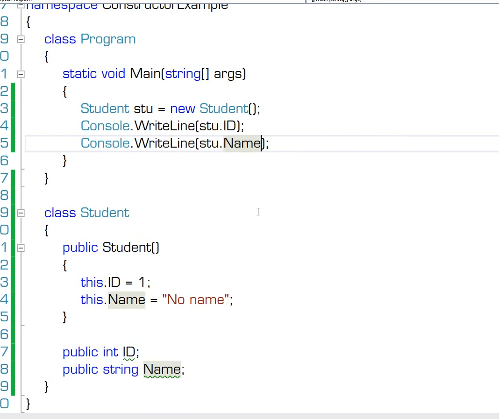
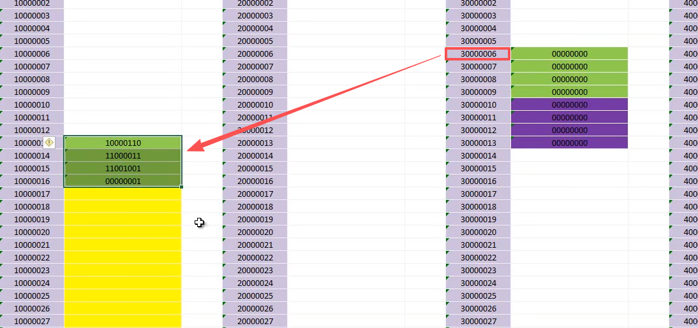
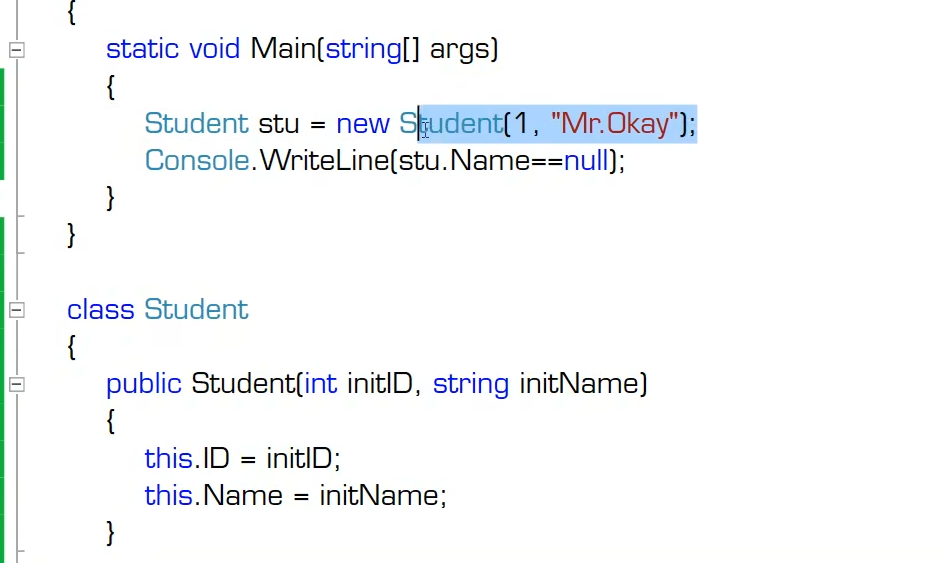
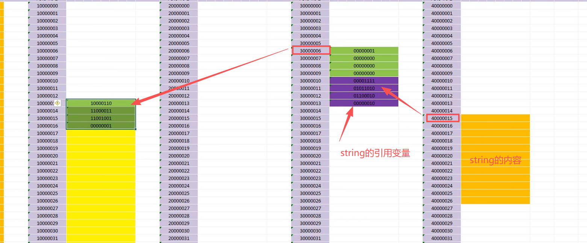

# 方法的定义、调用与调试

- 方法的定义与调用:
  - 分解算法
  - 复用方法
- 构造器（一种特殊的方法），又叫构造函数，带参数构造函数，不带参数构造函数
  
  - 构造器（constructor）是类型的成员之一
  - 狭义的构造器指的是“实例构造器（instance constructor）”
  - 如何调用构造器
  - 声明构造器
  - 构造器的内存原理
    - 无参构造函数
    
    - 带参构造函数
    
    
- 方法的重载（（OverLoad）
  - 调用重载方法的示例
  - 声明带有重载的方法
    - 方法签名（method signature）由方法的名称、类型形参的个数和它的每一个形参（从左到右的顺序）的类型和种类（值、引用ref或输出out）组成。方法不包含返回类型。
    - 实例构造函数签名由它的每一个形参（按从左到右的顺序）的类型和种类（值、引用 ref 或输出 out）组成。
    - 重载决策（到底调用哪一个重载）用于在给定了参数列表和一组候选函数成员的情况下，选择一个最佳函数成员来实施调用。

