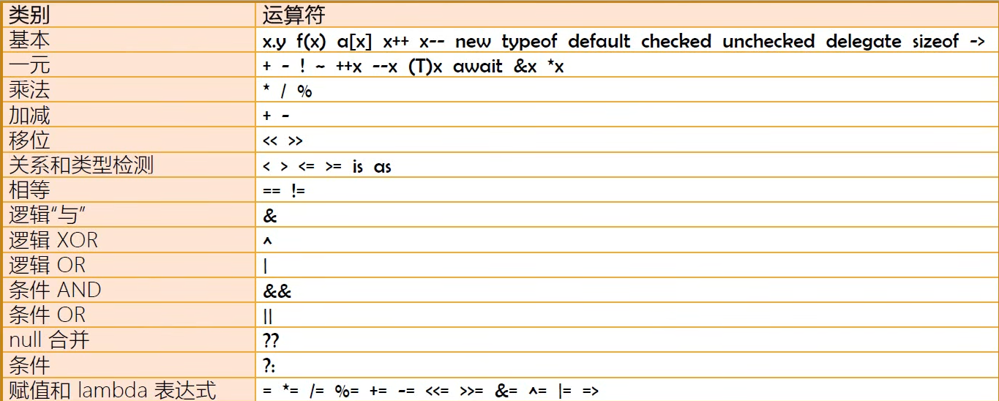
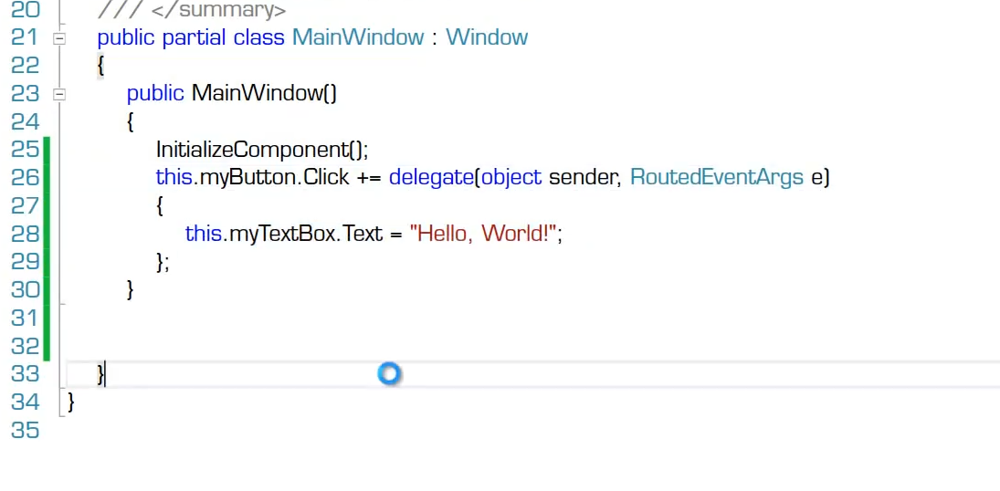
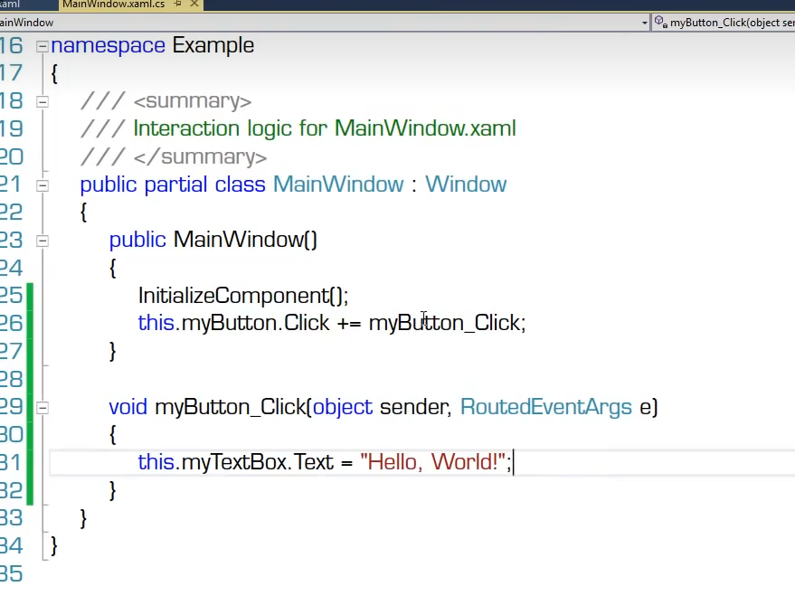
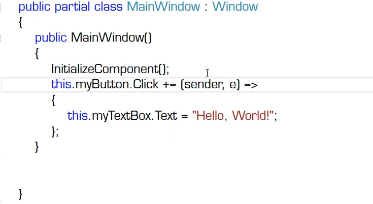
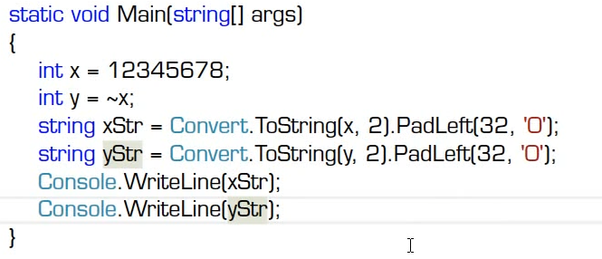
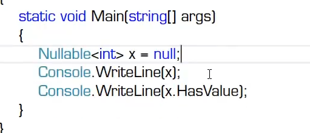
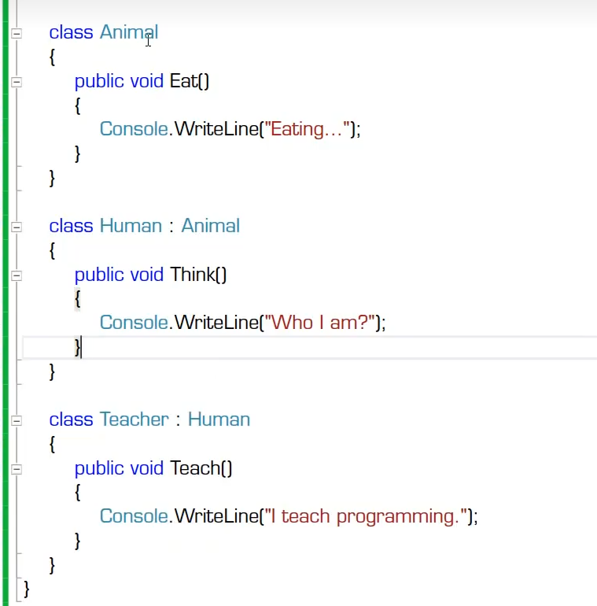
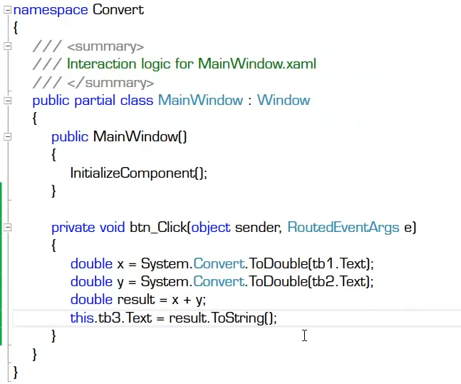
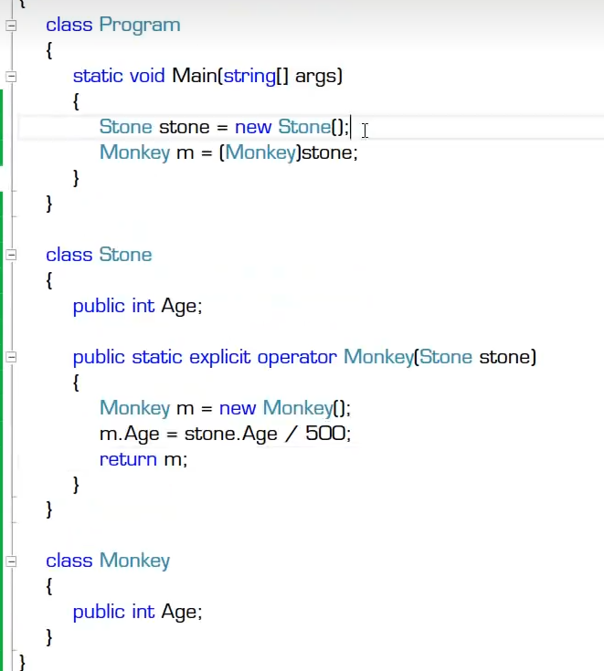

# 操作符详解

- 操作符概览
  - 
  - 操作符也译为“运算符”
  - 操作符是用来操作数据的，被操作的数据成为操作数
- 操作符的本质
  - 操作符的本质是函数（算法）的简记法
    - 假如没有发明“+”，只有Add函数,算式3+4+5可以写成Add(Add(3,4),5)
  - 操作符不能脱离与它关联的数据类型
    - 操作符是与它固定数据类型相关联的一套基本算法的简记法
    - 示例：为自定义数据类型创建操作符
- 操作符的优先级
  - 可以使用圆括号提高被括起来表达式的优先级
  - 圆括号可以嵌套
  - C#里[]与{}有专门的用途
- 同级操作符的运算顺序
  - 除了带有赋值功能的操作符，同优先级操作符都是由左向右进行运算
  - 带有赋值功能的操作符的运算顺序是由右向左
  - 计算机语言的同优先级运算没有结合律
- 各类操作符的示例
- 基本操作符
  - new操作符
    - 调用实例的构造器 new form() 
    - 调用实例的初始化器 new form(){Text="hello"},初始化可以初始多个属性
    - string 实际给隐藏了new操作符，如：string name = new shrting();
    - 数组类型一样可选new操作符
    - 为匿名类型创建实例： var person = new {Name = "MR.OKAY",Age=34}; 这个时候体现匿名类的功能，在不知道用什么类型的时候可以用
    - new 作为修饰符 ：子类对父类方法隐藏 new public void Report(){}
  - checked 和 unchecked
    - checked检查是否溢出： uint = checked(uint.MaxValue+1);   配合try - catch（OverflowException ex）使用。
    - unchecked模式不检查溢出：默认是unchecked方法。
    - checked{ 里面的内容都会检查溢出}
  - delegate 最常用的是声明委托数据类型，lamda表达式已经取代把delegate当操作符使用的场景。
    - delegate匿名方法的button事件  
    - 正常的挂接button事件 
    - 使用lamda表达式（**=>**）的button匿名函数挂栽事件 
  - sizeof 操作符
    - 获取对象在内存中占字节数，默认情况下 只能获得基本数据类型，除string和object
    - 在unsafe，可以获得自定义结构体的大小
  -  ->
     -  在unsafe状态下的指针，且只能操作结构体类型，不能操作引用类型 
- 一元操作符
  - +正
  - -负（用这个运算符取相反数会出错）
  - ！非（只能操作bool类型的数）
  - ~按位取反运算（按位取反+1 可得相反数）
    - 
  - （T）x  强制类型转换操作符 
    - 案例1：使用Console.Readline()读取用户输入的时候，默认的是string类型。需要进行转换。比如转换成Int类型，可以使用Convert.ToInt32(),或者直接使用（int）str
  - 移位运算符
    - << 和 >>:
    - 在没有数据溢出的情况下：左移*2 右移/2  
    - 左移补0
    - 右移：正数补0，负数补1
  - is as 操作符
- 二进制、图片相关操作的运算
  - 逻辑与，&
    - 按位求与，有0为0
  - 逻辑位或： 
    - 有1为1
  - 逻辑异或，^
    - 不同为1，相同为0
- 条件与 &&
- 条件或 ||
- null 合并  
  -  ??
     -  
     -  Nullable 可以用int?代替
     -  int y = x??1  //代表 x值是null的话返回1，是null的话返回1
-  条件操作符
   -  ?:
  
- 类型转换
  - 隐式（implicit）类型转换
    - 不丢失精度的转换
    - 子类向父类的转换(多态的基本机制)
    - 装箱
  - 显式（explicit）类型转换
    - 有可能丢失精度（甚至发送错误的转换）
    - 拆箱
    - 使用Convert类
      - 
    - Tostring方法与个数据类型的Parse/TryParse方法
      - Parse方法只能转换正确类型，否则抛出异常
      - 特别说明：科学计数法写法 1e2代表数字。1*10²
  - 自定义类型转换操作符
    - 