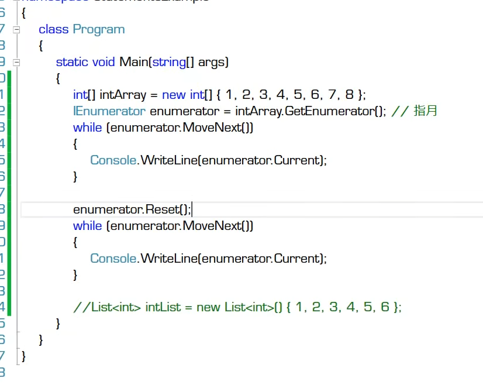
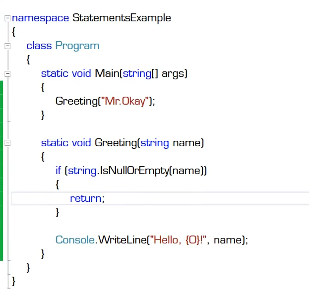

# 语句

- 语句详解
  - 声明语句
    - 局部变量声明
    - 局部常量声明 用const 修饰。Const int x = 100;
  - 表达式语句
  - 块语句
  - 选择（判断、分支）语句
    - if else
    - switch case default 
  - 迭代（循环）语句
    - for
    - while
    - do while
    - foreach 对集合遍历的简记法
      - 使用迭代器的便利集合 
  - 跳转语句
    - break
    - continue
    - goto
    - return 尽早return原则
      - 
    - throw
  - try-catch-finally语句
