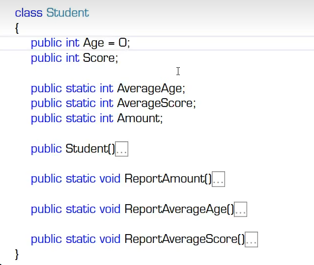
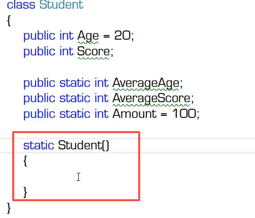
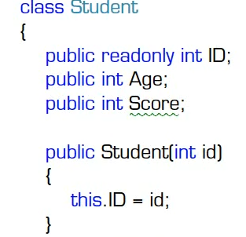
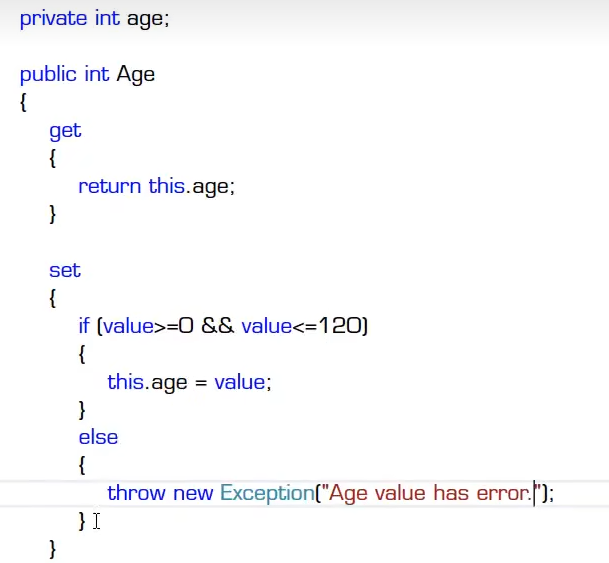
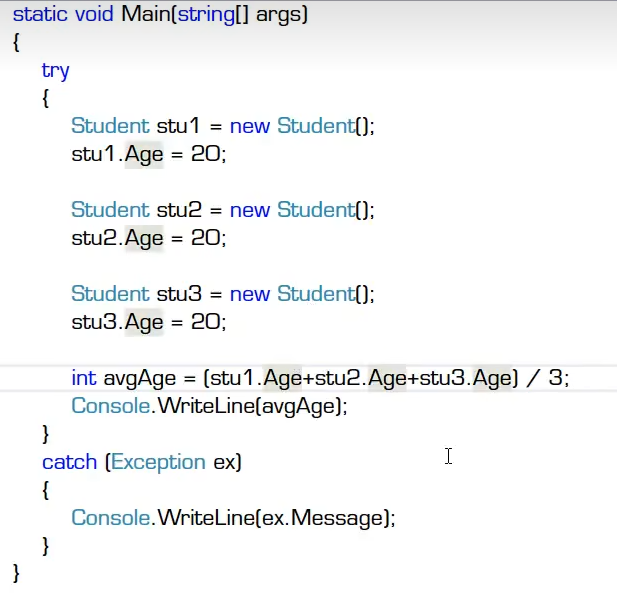
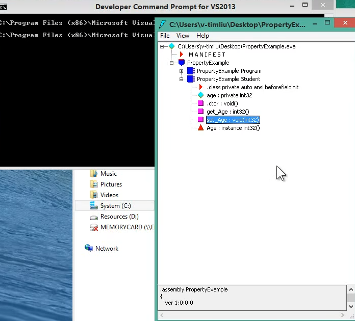
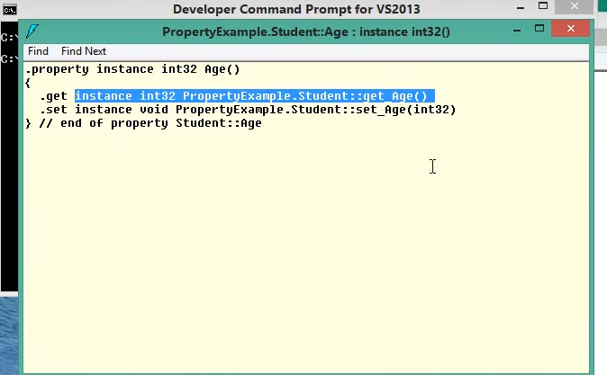
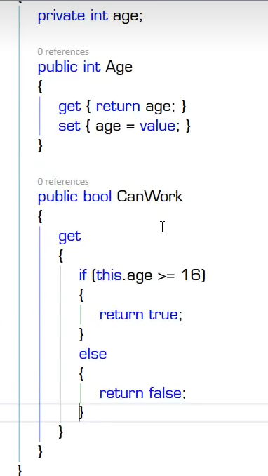
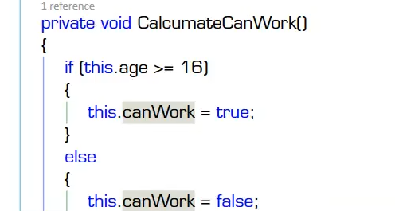
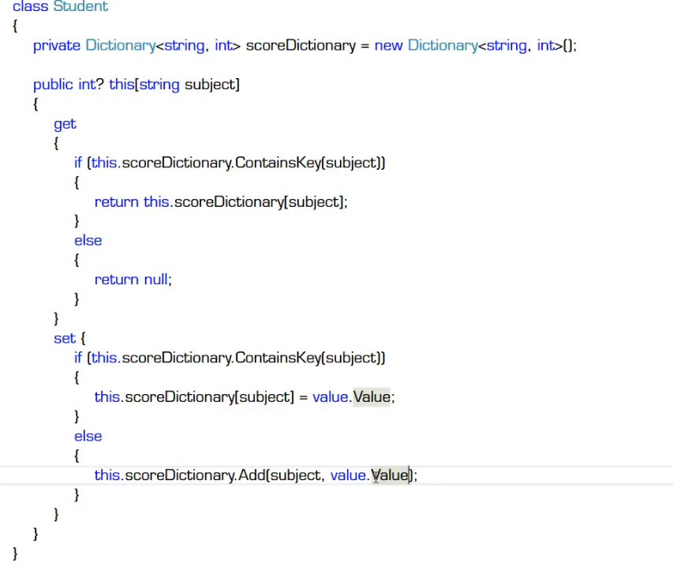

# 字段，属性，索引器，常量

## 字段

- 什么是字段
  - 字段（field）是一种表示与对象或类型（类与结构体）关联的变量
  - 字段是类型的成员，旧称“成员变量”
  - 与对象关联的字段亦称“实例字段”
  - 与类型关联的字段称为“静态字段”，由static休市
- 字段的声明
  -  attributes(opt) field=modifiers (opt) type variable-declarators ;
  -  

  - 字段声明带分号，但它不是语句
  - 字段的名字一定是名词
- 字段的初始值
  - 无显式初始化时，字段获得其类型的默认值，所以字段“永远都不会未被初始化”
  - 实例字段初始化的时机--对象创建时
  - 静态字段初始化的时机--类型被加载（load）时
    -  静态构造器：
     -  
- 只读字段
  - 实例只读字段 readOnly 修饰符
    - 
  - 静态只读字段

## 属性
  
- 什么是属性
  - 属性（property）是一种用于访问对象或类型的特征的成员，特征反映了状态
  - 属性是字段的自然扩展
    - 从命名上看，field梗偏向于实例对象在内存中的布局，property更偏向于反映现实世界对象的特征
    - 对外：暴露数据，数据可以是存储在字段里的，也可以是动态计算出来的
    - 对内：保护字段不被非法值“污染”
  - 属性由Get/Set方法对进化而来
    - 
    - value在特定的环境里为关键字，这里是微软准备的变量
    - 
  - 属性语法糖
    - 
    - 
- 属性的声明 快捷键prop+tab .propfull+tab
  - 完整声明——后台（back）成员变量与访问器（使用code snippet 和refactor工具）
   - 私有属性，只能在类内部使用
  - 简略生命——只有访问器（查看IL代码）
  - 动态计算值的属性
    - 
    - 
  - 注意实例属性和静态属性
  - 属性的名字一定是名词
  - 只读属性——只有getter,没有setter
    - 尽管语法上正确，几乎没有人使用只写属性，因为属性的主要目的是通过向外暴露数据而表示对象/类型的状态

- 属性与字段的关系
  - 一般情况下，他们都用于表示实体（对象或类型）的状态
  - 属性大多数情况下是字段的包装器（wrapper）
  - 建议：永远使用属性（而不是字段）来暴露数据，即字段永远都是private或protected的
  
## 索引器

- 什么是索引器
  - 索引器是一种成员：使对象能够用与数组相同的方式（即使用下标）进行索引
  - 
- 索引器的声明

## 常量

- 什么是常量
  - 常量（Constant）是表示常量值（即，可以在编译时计算的值）的类成员
  - 常量隶属于类型而不是对象，即没"实例常量"
    - ”实例常量“的角色由只读实例字段来担当
  - 注意区分成员常量与局部常量
- 常量的声明
- 各种”只读“的应用场景
  - 为了提高程序可读性和执行效率——常量
  - 为了放置对象的值被改变——只读字段
  - 向外暴露不允许修改的数据——只读属性（静态或非静态），功能与常量有一些重叠
  - 当希望成为常量的值其类型不能被常量声明接受时（类/自定义结构体）——静态只读字段