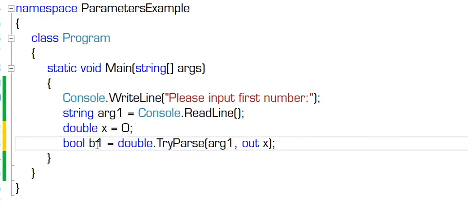
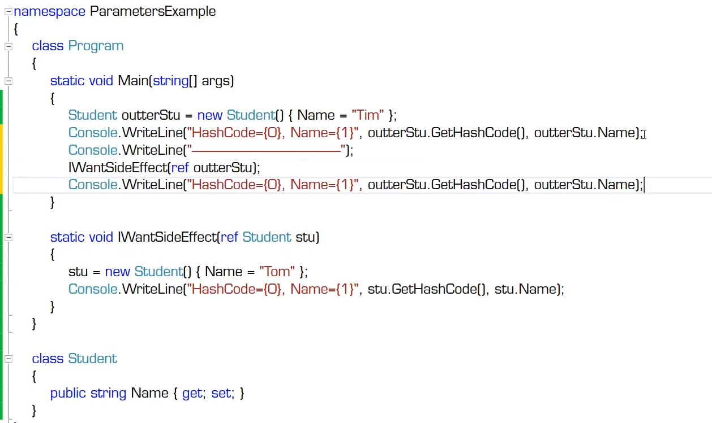
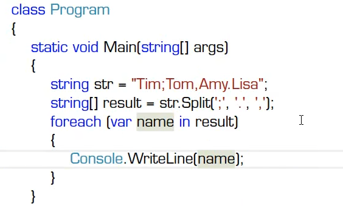
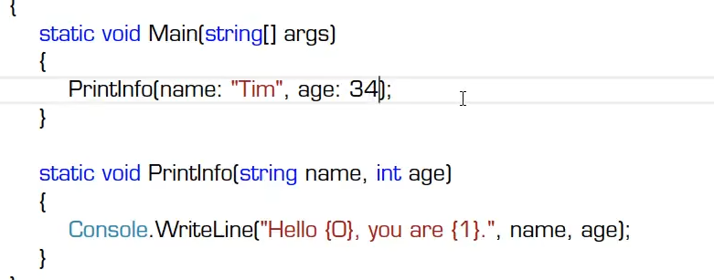
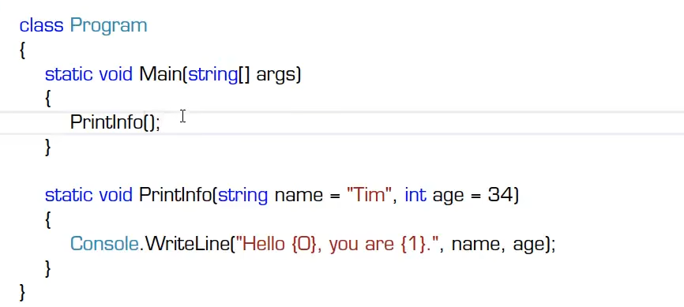
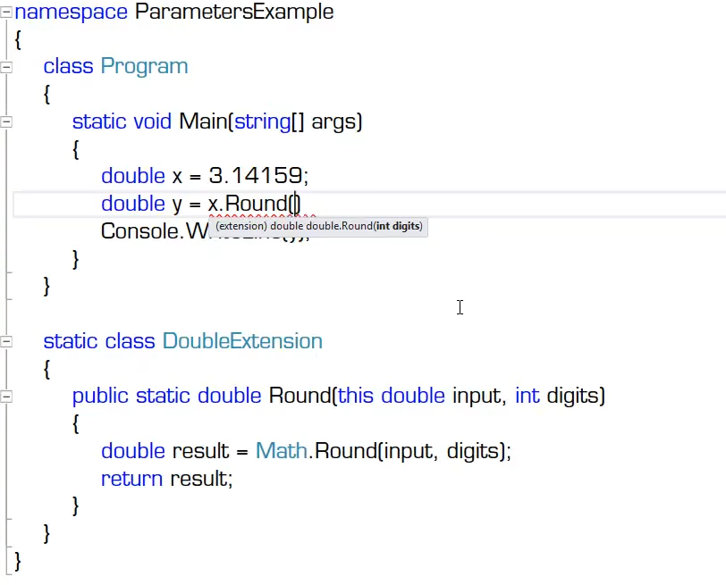
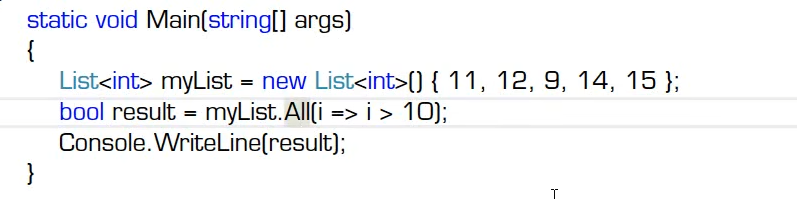
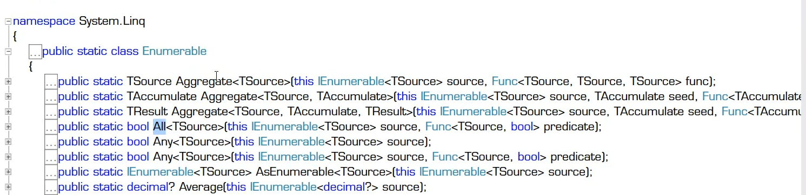

# 传值/输出/引用/数组/具名/可选参数，扩展方法

## 传值参数

## 输出参数
out修饰符

## 引用参数

ref修饰符

## 数组参数

- 必须是形参列表中的最后一个，由params修饰
- String.Format方法和String.Split方法
- 

## 具名参数
具名参数的使用方式

使用可增加可读性
## 可选参数
- 参数因为具有默认值而变得可选
- 不推荐使用可选参数
- 

## 扩展方法（this参数）
  
- 方法必须是公有、静态的，即被public static所修饰
- 必须是形参列表中的第一个，由this休市
- 必须由一个静态类（一般类名为SomeTypeExtension）来统一收纳对SomeType类型的扩展方法
- 举例：LINQ方法

- 案例 linq判断集合里的值是否都大于10
- System.Linq;
- 
- 

## 各种参数的使用场景总结

- 传值参数：参数的默认传递方式
- 输出参数：用于除返回值外还需要输出的场景
- 引用参数：用于需要修改实际参数值的场景
- 数组参数：用于简化方法的调用
- 具名参数：提高可读性
- 可选参数：参数拥有默认值
- 扩展方法（this参数）：为目标数据类型“追加方法”