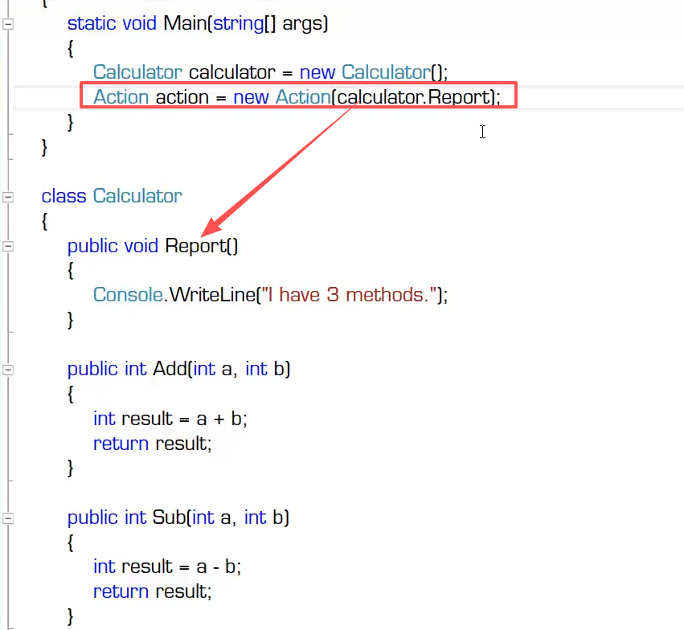
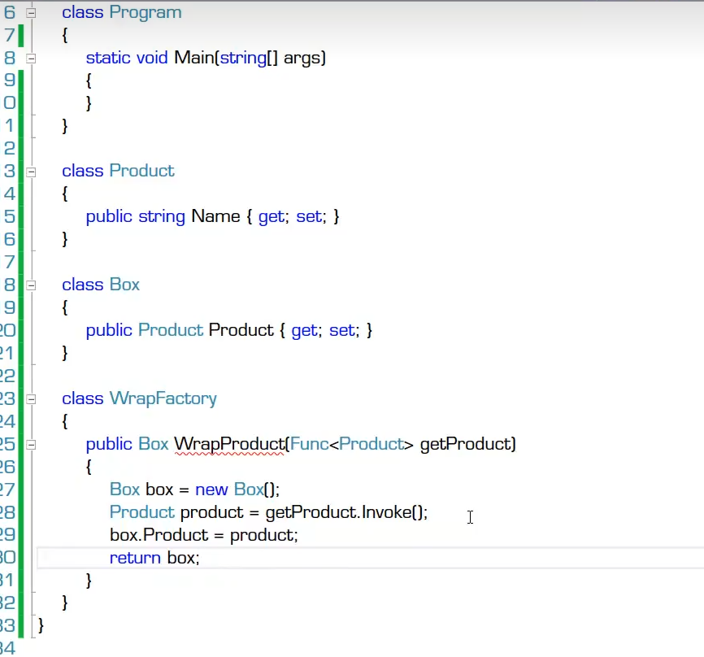
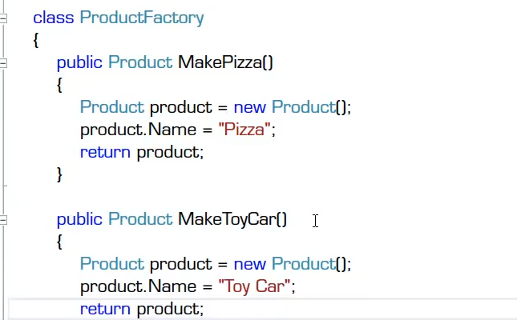
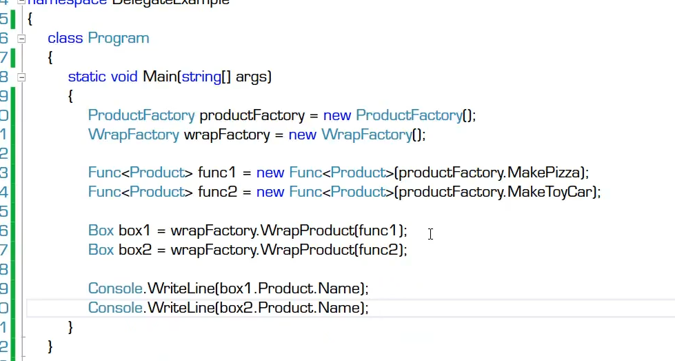
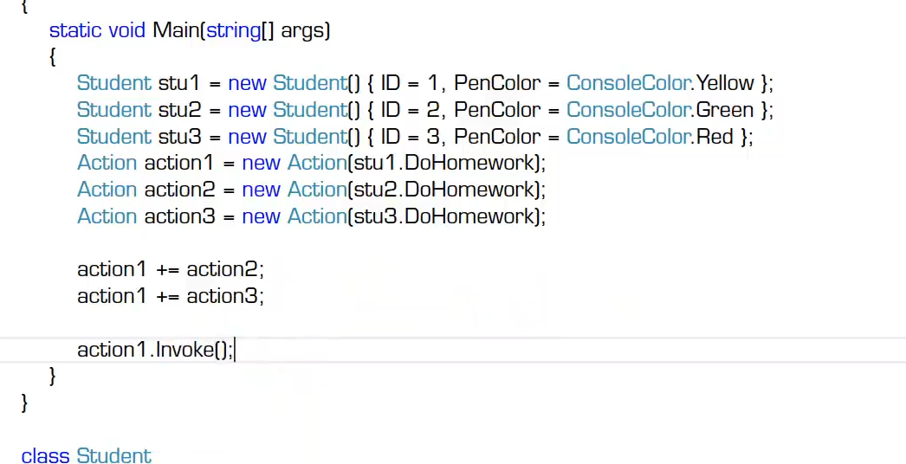
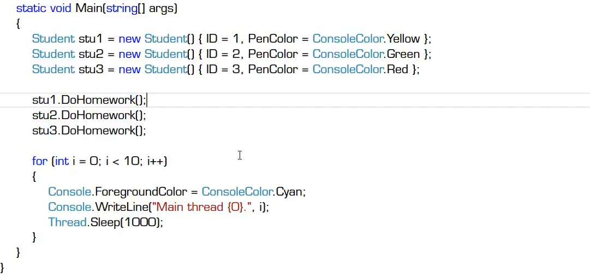
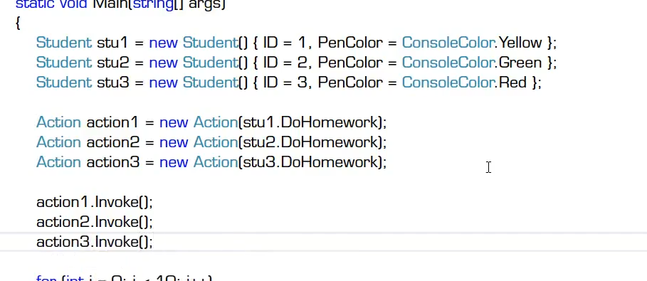
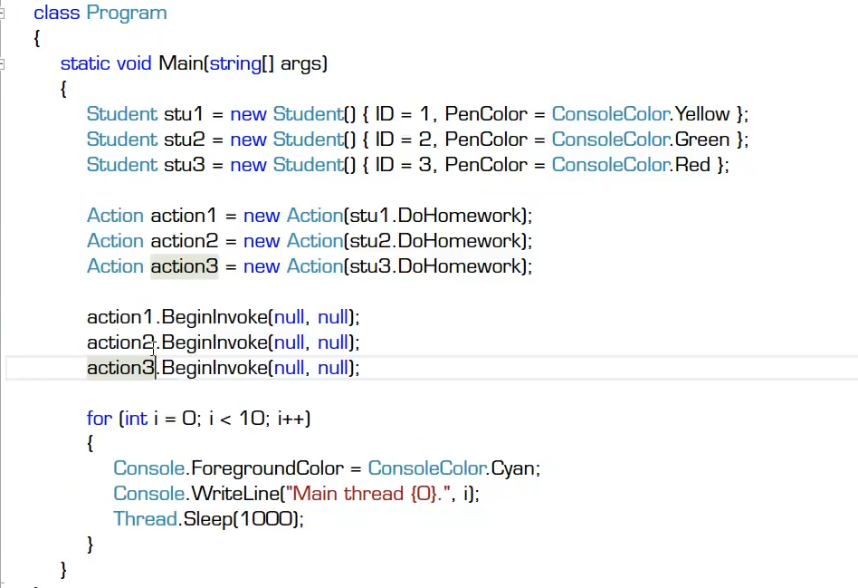
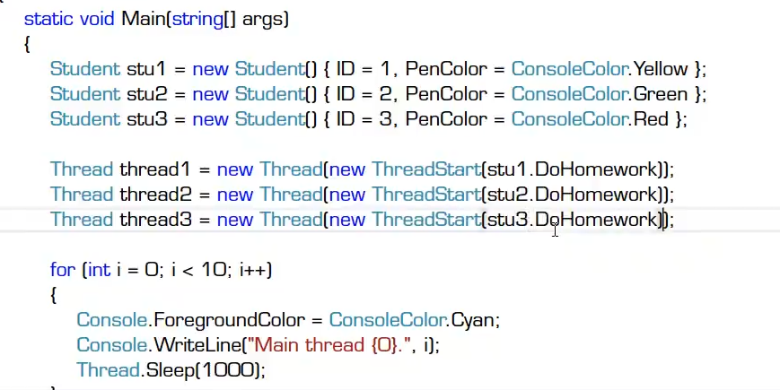
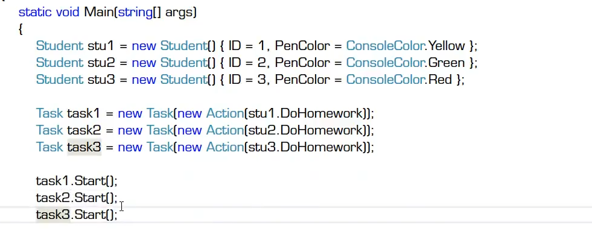

# 委托

## 什么是委托
- 委托（delegate）是函数指针的“升级版”
  - 实例C/C++中的函数指针
- 一切皆地址
  - 变量（数据）是以某个地址为起点的一段内存中所存储的值
  - 函数（算法）是以某个地址为起点的一段内存中所存储的一组机器指令
- 直接调用与间接调用
  - 直接调用：通过函数名来调用函数，CPU通过函数名直接获得函数所在地址并开始执行->返回
  - 间接调用：通过函数指针来调用函数,CPU通过读取函数指针所存储的值获得函数所在地址并开始执行->
- 委托的简单使用:类库中自带的委托类型
  - Action委托
    - Action action = new Action();//Action指向的是无返回值的函数，括号里放的是函数名，切记不能加上（）
    - 
    - 调用方式：action.Invoke()或action();
  - Func委托
    - Func<> func1 = new Func<>(ApplySauce);//<>里可放参数，其中最后一个参数为返回值类型的参数。括号里放函数名。
    - 调用方式 func1.Invoke()或func1();

可以理解为函数指针

## 委托的声明

-自定义委托
- 委托是一种类（class），类是数据类型所有委托也是一种数据类型
- 它的声明方式与一般的类不同
- 注意声明委托的位置，避免写错地方结果成嵌套类型
  - 因为是一种类型，所以不要写在类里面，要写在命名空间内。
  - public delegate double Calc(double x,double y);
- 调用方式
  - Calc calc1 = new Calc();//括号内要传入与声明时类型一致的函数名。参数名可以不一样。
    - calc1.Invoke()或calc1();
## 委托的使用

- 实例：把方法当作参数传给另一个方法
  - 正确使用1：模板方法，“借用”指定的外部方法来产生结果
    - 相当于“填空题”
    - 常位于代码中部
    - 委托有返回值
    - 
    - 
    - 
  - 正确使用2：回调（callback）方法，调用指定的外部方法
    - 相当于“流水线”
    - 常位于代码末尾
    - 委托无返回值
  - 注意：难精通+易使用+功能强大的东西，一旦被滥用则后果非常严重
    - 缺点1：这是一种方法级别的紧耦合，现实工作谨慎使用
    - 缺点2：使可读性下降、debug的难度增加
    - 缺点3：把委托回调、异步调用和多线程纠缠在一起，会让代码变得难以阅读和维护
    - 缺点4：委托使用不当有可能造成内存泄漏和程序性能下降

## 委托的高级使用

- 多播（multicast）委托
  - 一个委托里不止一个方法。
  - 
- 隐式异步调用
  - 同步与异步的简介
    - 同步指的轮着做
    - 异步指的是同时做
  - 同步调用与异步调用对比
    - 每一个运行的程序是一个进程（process）
    - 每个进程可以有一个或者多个线程（thread）
    - 同步调用是在同一线程内
    - 异步调用的底层机制是多线程
    - 串行==同步==单线程，冰箱==异步==多线程
  - 隐式多线程VS显式多线程
    - 直接同步调用：使用方法名
      - 
    - 间接同步调用：使用单播/多播委托的Invoke方法
      - 
    - 隐式异步调用：使用委托的BeginInvoke（BeginInvoke会打开一个分支线程进行调用）
      - 
    - 显式异步调用：使用Thread或Task
      - thread用法
      - 
      - task用法
      - 
  - 应该适时地使用接口（interface）取代一些对委托的使用。