# 事件

## 初步了解事件

- 定义 ：单词Event,译为事件
  - 能够发生的什么事情
- 角色：使对象或类具备通知能力的成员
  - 事件是一种使对象或类能够提供通知的成员
  - 对象O拥有一个事件E：当事件E发生的时候，O有能力通知别的对象
- 使用：用于对象或类间的动作协调与信息（参数：）传递（消息推送）
- 原理：事件模型（event model）中的两个5
  - “发生->响应”中的5个部分————订阅关系
  - “发生->响应”中的5个动作
    - 1.有一个事件
    - 2.一个人或者一群人关心这个事件
    - 3.这个时间发生了
    - 4.关心这个事件会被**依次**通知到
    - 5.被通知的人根据拿到的事件信息（又称事件数据、事件参数、通知:EventArgs）对事件进行响应（又称处理事件 ： Event Handler）
  - 事件相关的角色
    - 事件参数
    - 事件的订阅者
  - 提示
    - 事件多用于桌面、手机等开发的客户端编程，因为这些程序经常是用户**通过事件来驱动**的
    - 各种编程语言对这个机制的实现方法不尽相同
    - Java里没有事件这种成员，也没有委托这种数据类型。Java的事件是使用接口来实现的
    - MVC、MVP、MVVM模式，是事件模式更高级、更有效的用法
    - 日常开发的时候，使用已有事件的机会比较多骂自己声明事件的机会比较少，所以先学使用。

## 事件的应用
    - 实例演示
      - 派生（继承）与扩展（extends）
- 使用timer类的Elapsed实现事件。使用ctrl+.可利用编辑器补全方法
  - 1.多个类订阅同一个事件：
  - 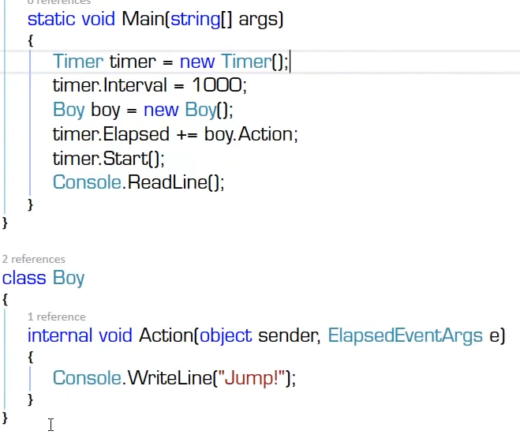
  - 2.事件的拥有者和事件的响应者为不同的对象，时间的响应者有着事件处理器订阅者事件拥有者的事件
  - 添加windows.form的命名空间进行示例
  - 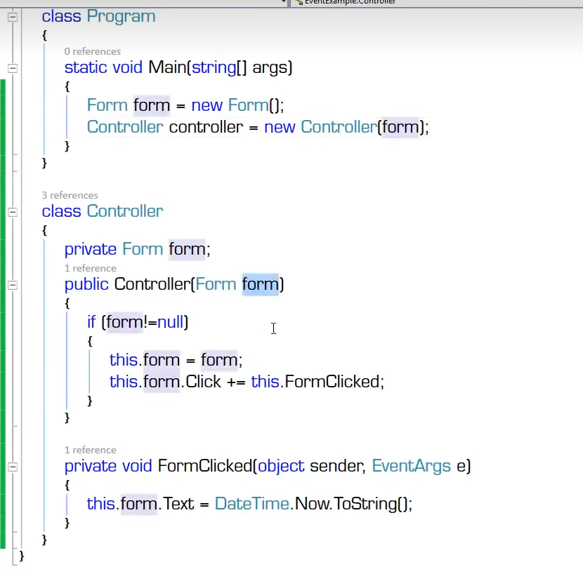
  - 3.时间拥有着和响应者是同一个
  - 利用form类派生MyForm做示例
  - 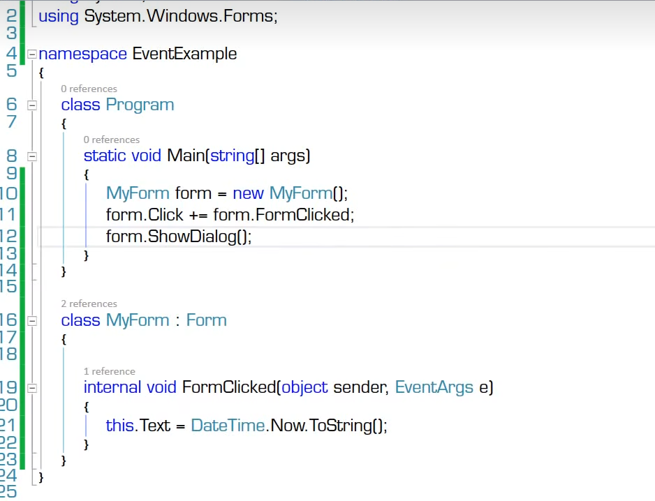
  - 4.事件的拥有者是事件的响应者的一个字段或成员，事件的响应者用自己的方法订阅着字段或成员
  - 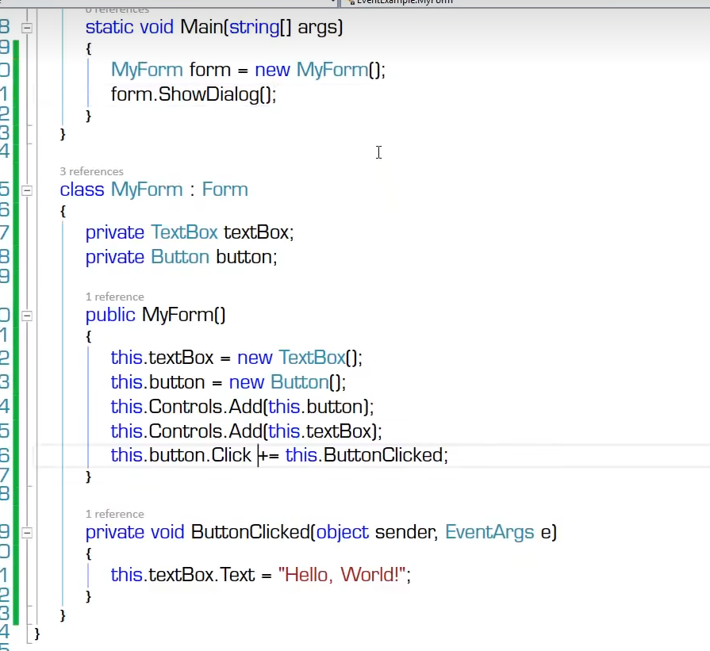
  - 引出winForm的开发方式
  - 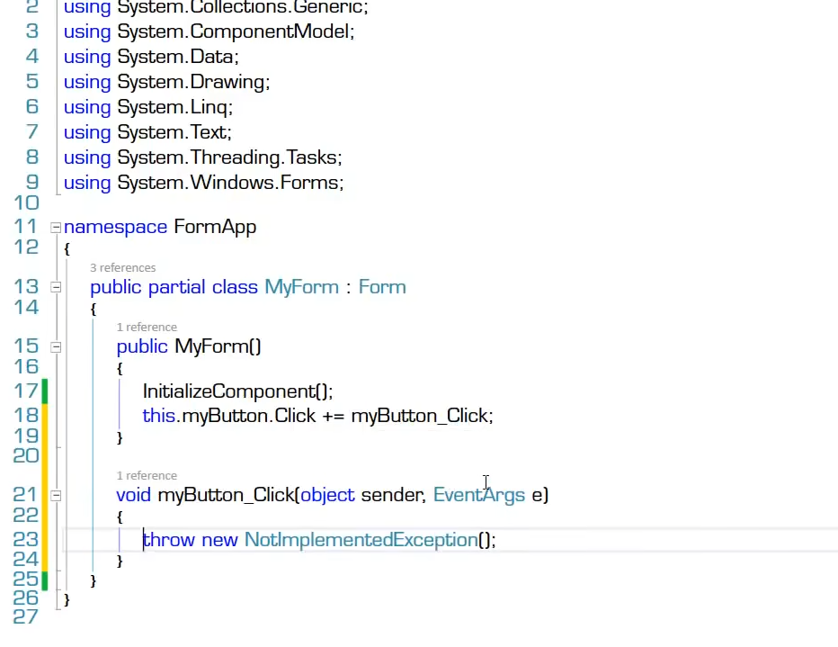 使用ctrl+R 可以同时修改使用该方法的方法名
  - 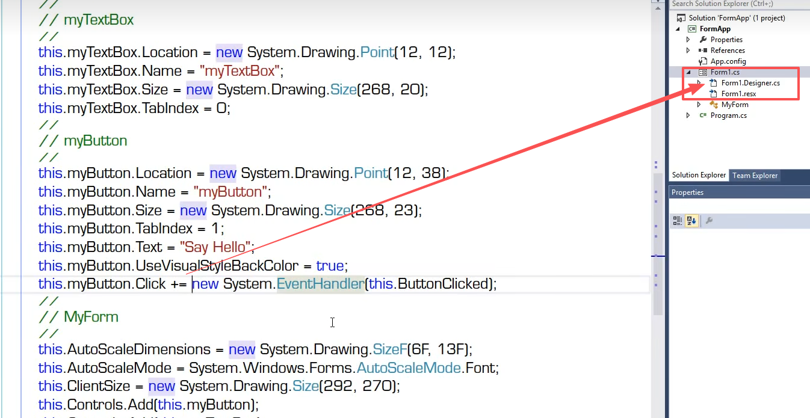
  - 5.同一个事件处理器可以操纵不同的来源：sender
  - 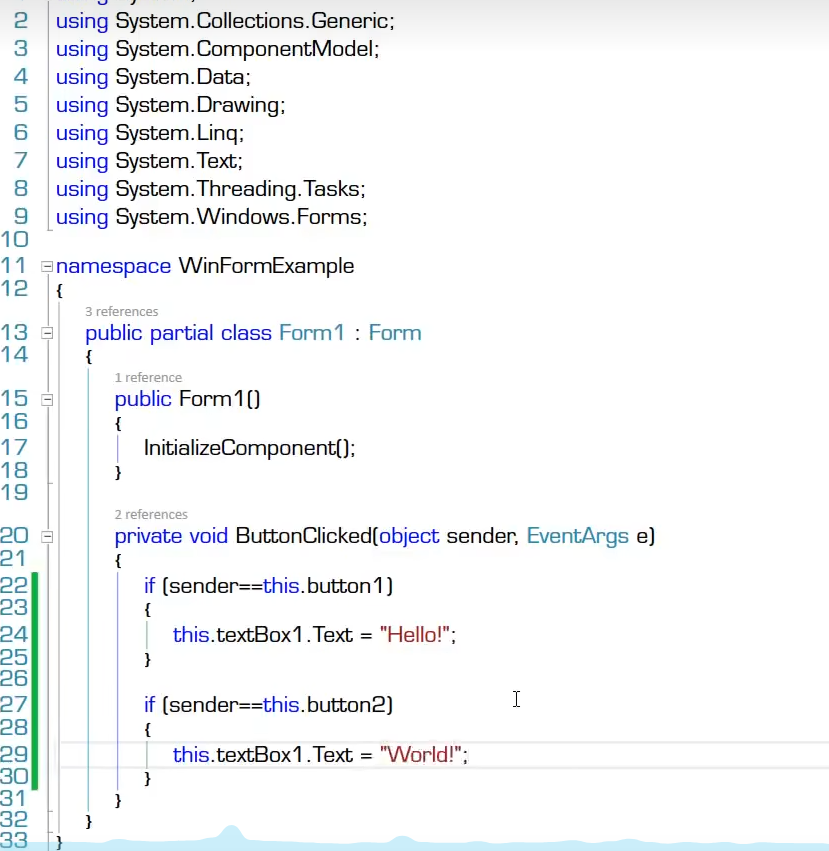
  - 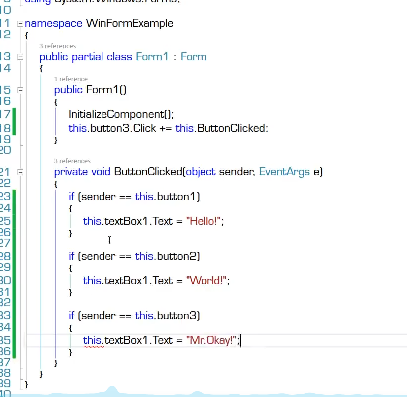
  - 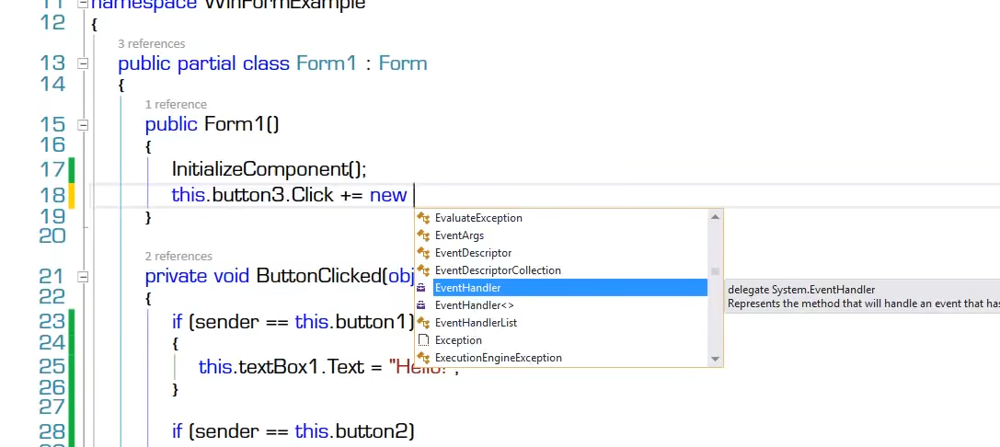 
  - 两种挂接方式
  - new后面可以看到委托类型
  - 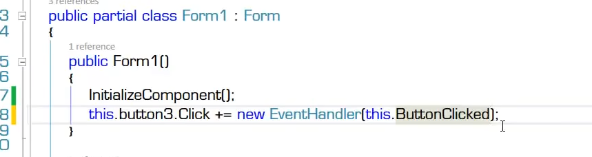
  - 使用匿名方法处理textbox
  - 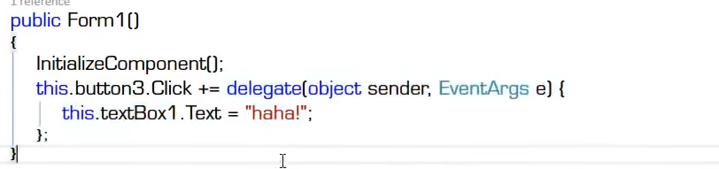
  - lamda表达式方式
  - 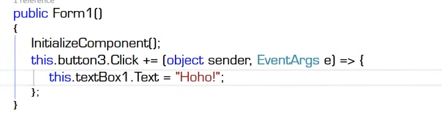
  - 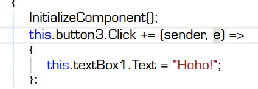
  - 引出WPF程序  样式设计使用xaml相关代码
  - 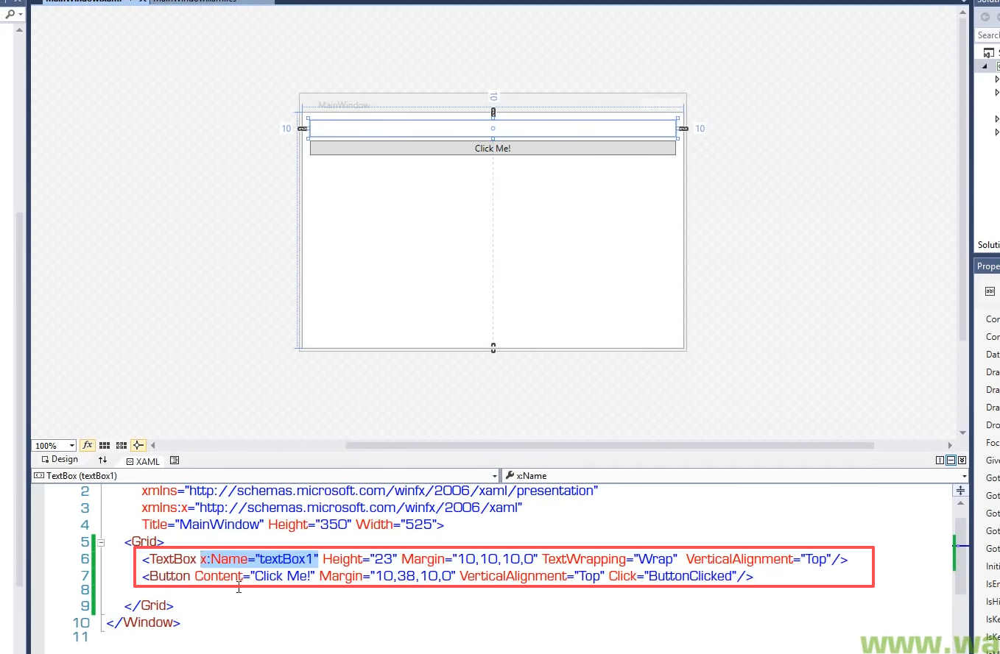
  - 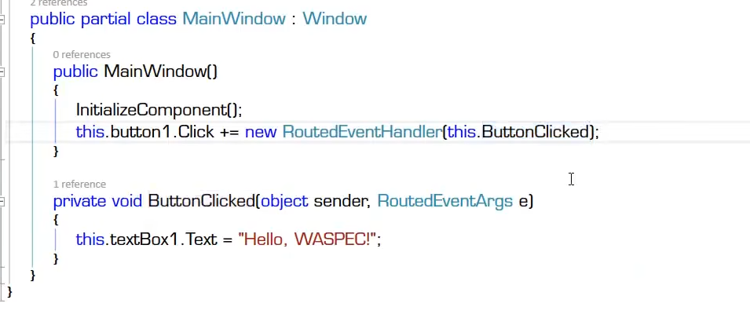

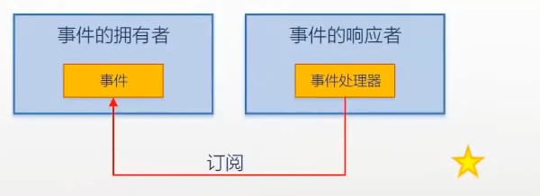

- 事件模型的五个组成部分
  - 事件的拥有者（event source , 对象）
  - 事件成员（event，成员）
  - 事件的响应者（event subscriber,对象）
  - 事件处理器（event handler,成员）——本质上是一个回调方法
  - 事件订阅——吧事件处理器与事件关联在一起，本质上是一种以委托类型为基础的“约定”
  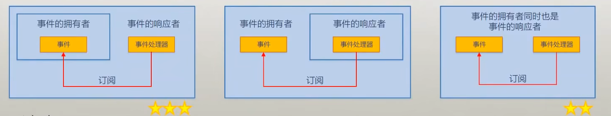

- 注意
  - 事件处理器是方法成员
  - 挂接事件处理器的时候，可以使用委托实例，也可以直接使用方法名，这是个语法糖
  - 事件处理器对事件的订阅不是随意的，匹配与否由声明事件时所使用的**委托类型**来检测
  - 事件可以同步调用也可以异步调用
## 深入理解事件

## 事件的声明

- 事件的声明
  - 完整声明
    - 先声明委托类型以及相关类：
    - 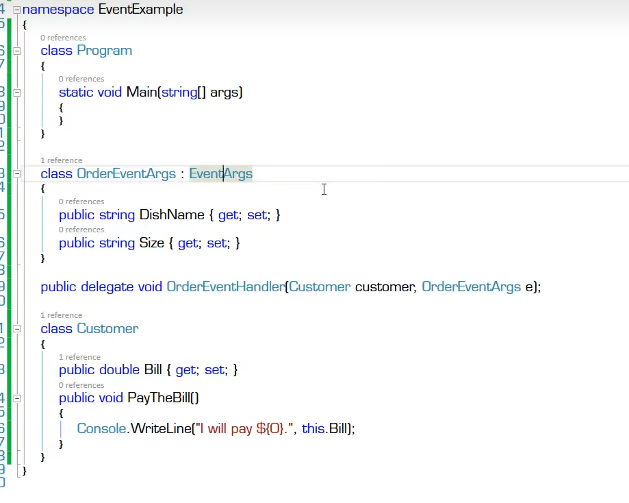
    - 声明委托事件，add为添加器，remove为移除器
    - 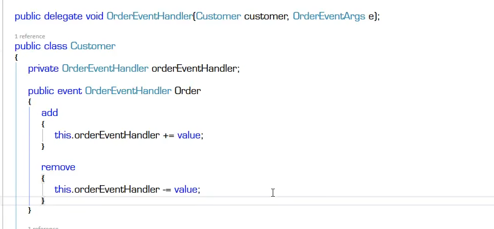
    - 使用事件
    - 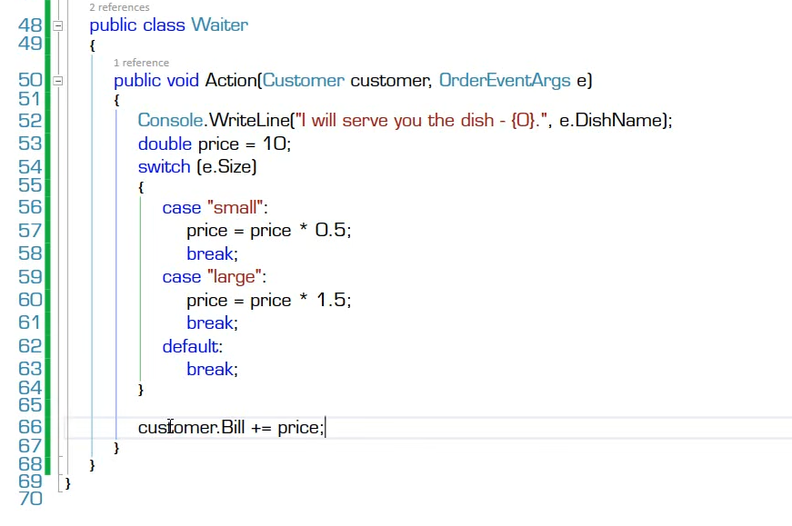
    - 处理响应时机
    - 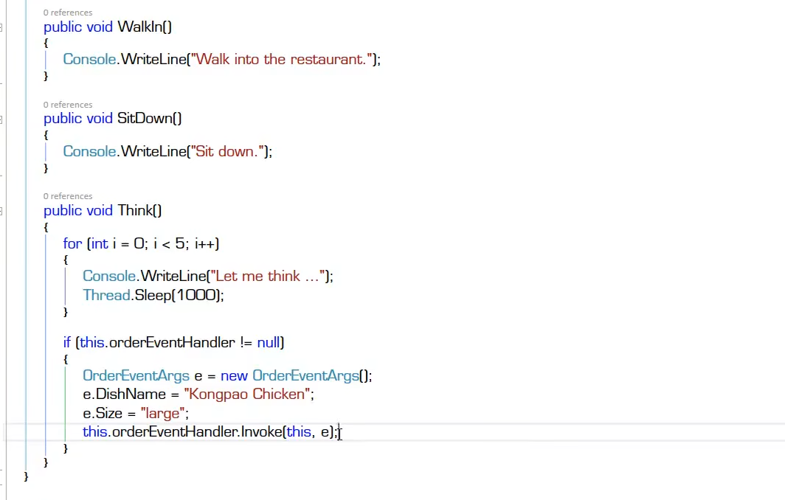
    - 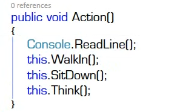
  - 简略声明（字段式声明，field-like）
- 有了委托字段/属性，为什么还需要事件？
   - 为了程序的逻辑更加“有道理”、更加安全，谨防“借刀杀人”
-  **事件的本质** 是委托字段的一个包装器
   - 这个包装器对委托字段的访问起**限制作用**，相当于一个“蒙版”
   - 封装（encapsulation）的一个重要功能就是隐藏
    - 事件**对外界**隐藏了委托实例的大部分功能，**仅暴露添加/移除事件处理器的功能**
    - 添加/移除事件处理器的时候可以直接使用方法名，这是委托实例所不具备的功能
- 用于声明事件的委托类型的命名约定
  - 用于声明Foo事件的委托，一般命名为FooEventHandler(除非是一个非常通用的时间约束)
    - FooEventHandler委托的参数一般有两个（由Win32 API演化而来，历史悠久）
      - 第一个是object类型，名字为sender，实际上是事件的拥有者、事件的source
      - 第二个是EventArgs类的派生类，类名一般为FooEventArgs，参数名为e。也就是事件参数
      - 虽然没有官方的说法，但可以把委托的参数列表看作是事件发生后发送给事件响应者的“**事件消息**”
  - 触发Foo事件的方法一般命名为OnFoo，即“**事出有因**”
        - 访问级别为protected，不能为Public，否则又可以“借刀杀人”
  - 事件的命名约定
     - 带有时态的动词或者动词短语
      - 事件拥有者“正在做”什么事情，用进行时；事件拥有者“做完了”什么事情，用完成时

## 问题辨析