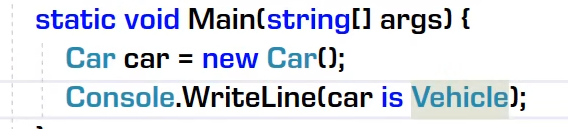
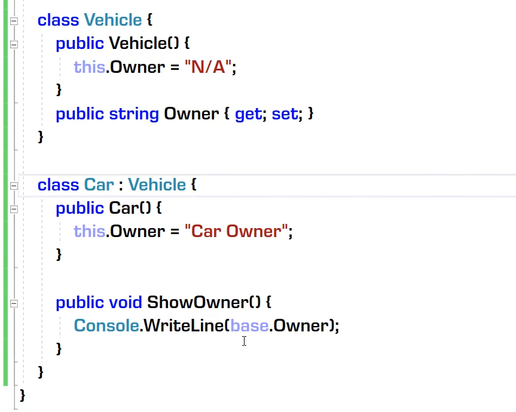
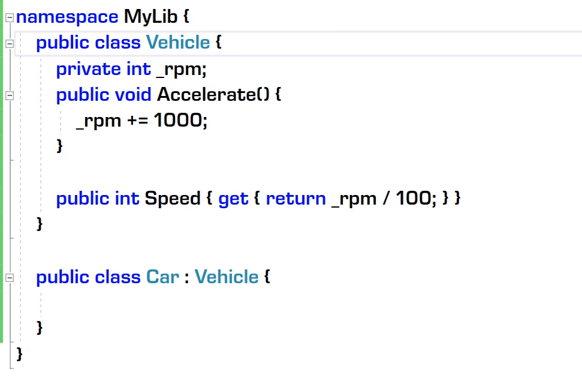

# 类 继承和多态

## 什么是类
- 是一种抽象数据结构（data structure）
  - 类本身是抽象的结果
  - 抽象数据和行为的载体
- 是一种数据类型
  - 一种引用类型
  - 创建的某一个类本身是一种自定义类型
  - 可以声明变量，创建实例后被视为实例的模板
- 代表现实世界中的”种类“

## 构造器和析构器 析构器释放资源

- 实例
``` c#

public class Student
{
    public static int Amount{get;set;}
    static Student()
    {
        Amount = 100;
    }
        //实例构造器
    Student(int id,string name)
    {
        this.id = id;
        this.Name = name;
        amoumt++;
        //实例创建时执行的逻辑

    }
    //实例析构器
    ~Student()
    {
        amoumt--;
        //实例释放前要执行的逻辑
    }
}
```
- 静态
  - 静态构造器
    

## 类的声明，继承和访问控制

- 类声明
  - 声明既定义，C++可以分开写也可以在一起写
- 最简单的类声明
  - 类的访问控制:public,internal,默认是internal，本项目内可访问的类。 public可通过外部项目引用该类。
  - 配置dll的名字等属性 
  - 
- 类的继承
  - is操作符 ：子类可以是父类，父类不可以是子类 ，as操作符：子类可以转换为父类，父类不可以子类。
    - 
    - 父类可以引用子类的实例
  - 类在功能上的扩展（extend），即成员可以更多，但不能更少。
  - 只能继承一个基类，但是可以实现多个基接口
    - 
  - 类访问级别对继承的影响
  - sealed类不能被继承 sealed class Vehicle
  - 子类成员访问级别不能超越父类
    - 比如基类是internal，派生类是public是不可以的。

- 成员的继承与访问
  - 派生类对继承成员的访问
  - 派生类对基类成员的访问
    - base关键字：子类对父类成员的使用 ：Base.Owner
      - 
    - 成员访问修饰符
      - private:子类不可访问该成员，默认为private
        - 
      - Protected:在该继承链的子类可以访问，可跨程序集。用的更多在方法上。
  - 构造器的不可继承性
    - 先构造基类对象后构造子类对象
    - 给父类的构造器有一个无参构造器，避免子类构造器出错
  


## 重写和多态
- 重写
  - 类成员的“横向扩展”（成员越来越多）
  - 类成员的“纵向扩展”（行为改变，版本增高）
    - 在父类要重写的成员标记 Virtual:public virtual void Run(){}  //又叫虚函数 虚成员
    - 在子类重写的成员标记：override:public override void Run(){}
  - 用父类实例化子类成员：
    - 实例化子类时，该引用变量可获得子类的实例。
    - 当调用未重写成员时，是隐藏父类成员，但可以使用父类成员
    - 当调用重写成员时，使用重写的成员
  - 类成员的隐藏（不常用）
    - 如果父类与子类不加重写相关关键字，则是子类对父类成员的隐藏
  - 重写与隐藏的发生条件：函数成员，可见，签名一致
    - 函数成员：都可以重写，如：方法、属性、事件等
    - 可见：父类成员是private时不可见，所以不能重写
    - 签名一致：指参数数量以及类型一致


- 多态（polymorohism）
  - 基于重写机制（virtual->override）
  - 函数成员的具体行为（版本）由对象决定
  - 回顾：C#语言的变量和对象都是有类型的，所以会有“代差”，Python没有