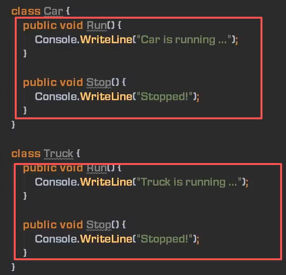
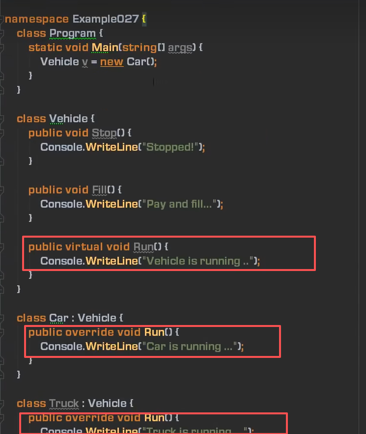
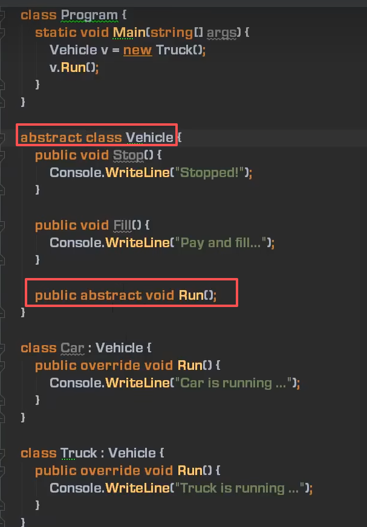

# 接口，抽象类，SOLID，单元测试，反射

## 什么是接口和抽象类

- 接口和抽象类都是“软件工程产物”
- 具体类->抽象类->接口：越来越抽象，内部实现的东西越来越少
- 抽象类是**未完全实现逻辑**的类（可以由字段和非public成员，它们代表了“具体逻辑”）
  - 一个类里的成员**至少有一个**abstract 修饰的成员，该类就是抽象类,必须要在class前也加上abstract关键字修饰

- 抽象类**为复用而生**(不能实例化抽象类)：专门**作为基类**来使用（父类声明引用子类的方式产生多态的效果），也具有解耦功能
- 封装确定的，开放不确定的，推迟到合适的**子类中去实现**
  - 方法被abstract修饰后，没有方法体：（又称为“纯虚方法”，虚方法还有方法体，子类可以重新实现方法而已，抽象方法是完全没有实现，必须要靠子类实现才行）
``` c#
abstract class Student
{
    abstract public void Study();
}

```

 违法设计原则：不可以复制粘贴，可以用基类派生而来，基类用虚方法替代复制粘贴操作，实例化时用多态去实例化父类下的子类即可。
 
 基类中的方法不需要，它只是为了让子类重写的方法而已，所以把方法体去掉。加上abstract，该方法成了抽象方法，该方法所在的类成为了抽象类。
 
 此时如果想添加相关类，只需要继承该基类并且实现其中的抽象成员即可，如果不实现抽象成员，会报错，除非该类也添加abstract关键字成为抽象类。

因为抽象类的方法体没有实现，所以不能实例化抽象类


## SOLID：

 O:开闭原则：如果不是为了修复bug或者添加新功能不去动类。（与抽象类相关）


- 接口是完全未实现逻辑的“类”（“纯虚类”；只有函数成员；成员全部public）
- 接口为解耦而生：“高内聚，低耦合”，方便单元测试
- 接口是一个“协约”，早已为工业生产所熟知（有分工必有协作，有协作必有协约）
- 接口和抽象类都不能实例化，只能用来声明变量、引用具体类（concrete class）的实例


