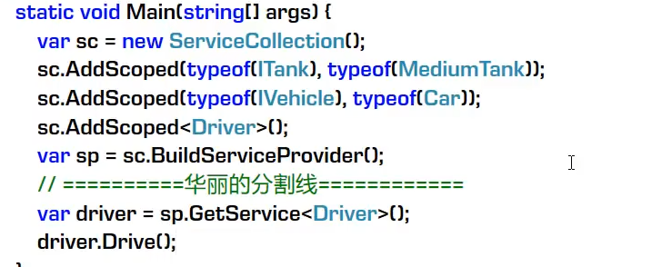
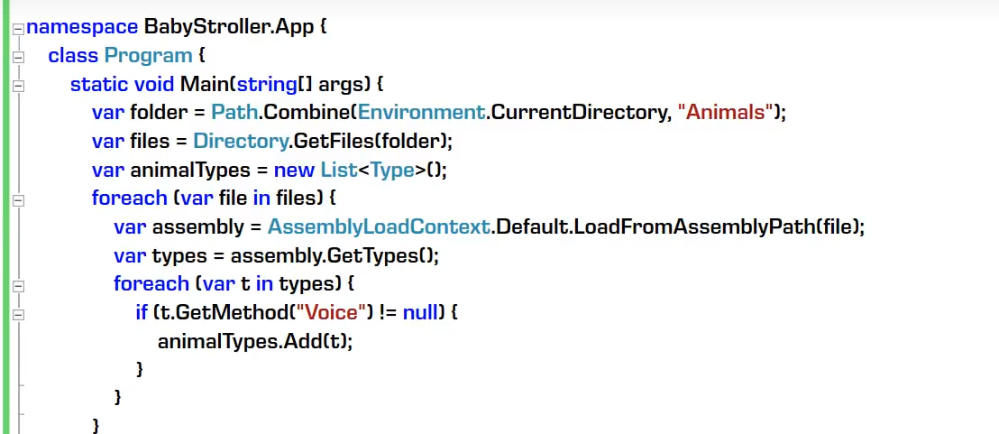
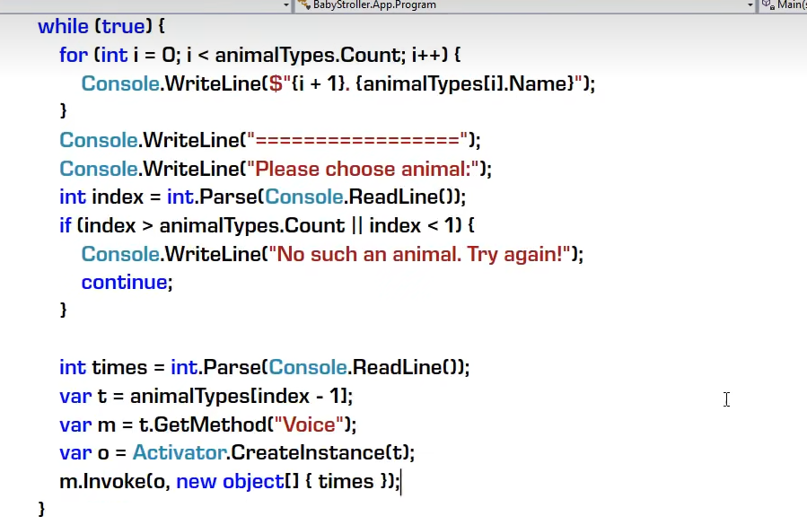
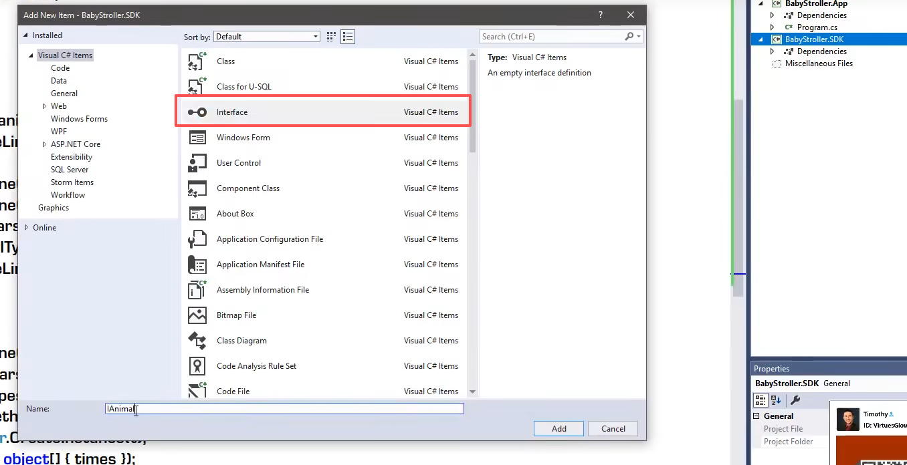
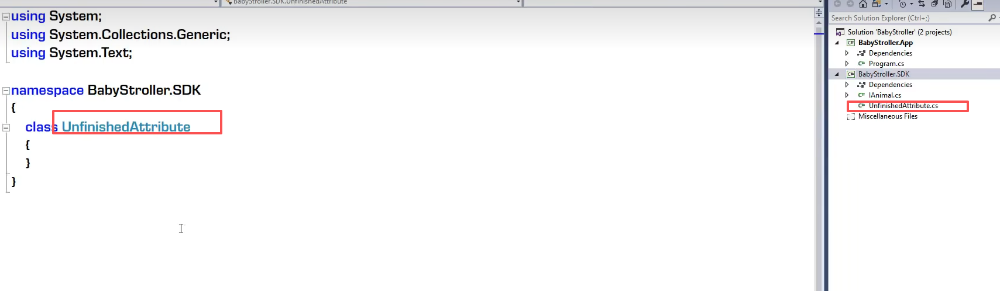
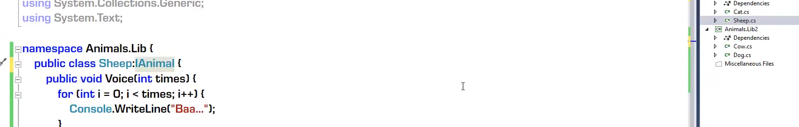
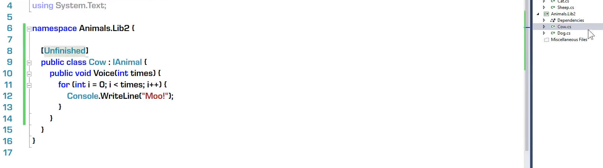
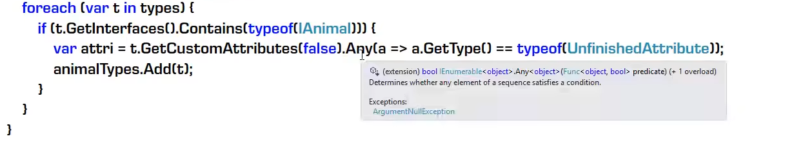

## 反射

- 反射与依赖注入
  - 反射：以不变应万变（更松的耦合）
  - 反射与接口的结合
  - 反射与特性的结合
- 用法：
  - 命名空间System.Reflection;
  - Type t =tank.GetType();
  - Activator:激活器类 Activator.CreateInstance(t);
  - 在知道这个类里的方法的狮虎可以这月调用，假设我知道里面有方法run()和fire
  - MethodInfo fireMi=t.GetMethod("Fire");
  - MethodInfo runMi=t.GetMethod("Run");
  - fireMi.Invoke(p,null);放入两个参数：第一个：要反射的对象，第二个：如果方法需要参数以数组的方式传入，如果没有传null。

## 封装好的反射--依赖注入
- 依赖注入框架
  - Nuget:Microsoft.Extensions.DependencyInjection
- 使用方法
  - using Microsoft.Extensions.DependencyInjection
  - var sc = new ServiceColletion();
  - sc.AddScoped(typeoe(ITank),typeof(HeavyTank));第一个参数：接口类型，第二个参数：哪个类实现的这个接口。注意不能之间把Itank放进去，因为ITank是个静态类型，需要用typeof（）将它转化为动态。
  - var sp = sc.BuildServiceProvider();
  - //以上在进行注册操作，ServiceColletion实际上是个容器。以后想使用这个接口时，不用new一个对象。可以在程序的任何地方进行调用。
  - ITank tank = sp.GetService<ITank>();
  - tank.Fire();
  - tank.Run();
  - 假如在项目升级时，需要将heavyTank换其他的，只需要改这一个地方，而不必在每个new HeavyTank();的地方去改。
  - 
  - 依赖注入实际上是注入到类的构造器中，内存中生成一个实例，在程序的任何地方都可以使用

## 反射--松耦合--插件式编程
插件：不与主体程序一起编译但是可以与主体程序一起工作的组件。比如MOD，且反射可以批量注入实例，而不需要为每一个进行实例化。

案例-婴儿车小程序：利用IO从项目文件夹中找到是否有某个文件，该文件是否有对应的method，如果有进行依赖注入。模拟SDK接受第三方修改。
第一方：

为帮助第三方不必要错误，第一方发布SDK需要准备：

- IAnimal 接口：
  - 所有的厂商都要实现这个IAniaml接口。
- 如果有没开发完的，要进行过滤：继承Arribute基类

发布SDK：
写配置说明书

第三方使用SDK：

没开发完的用特性标记：

主体文件更新第三方的dll

