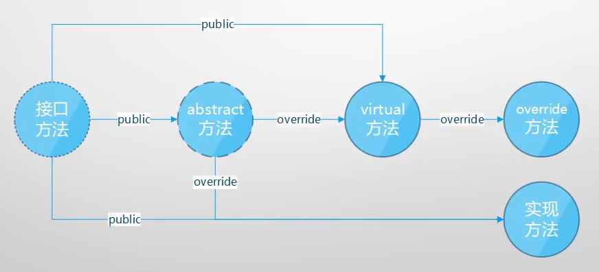
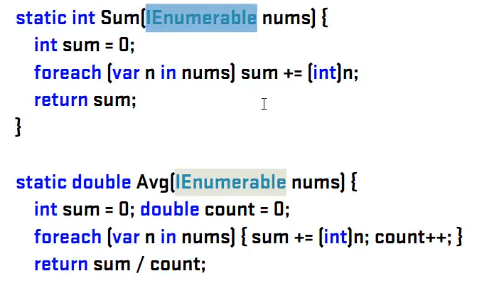
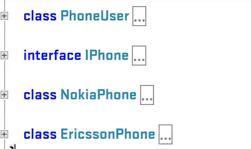
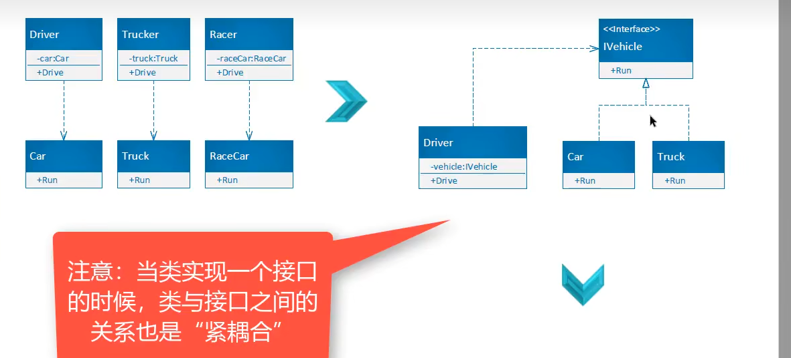
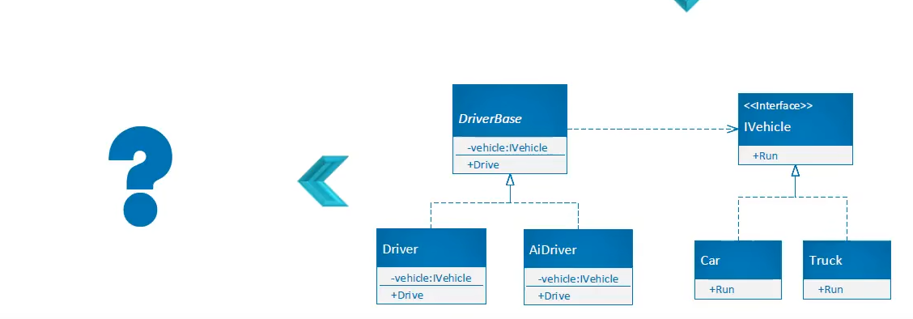
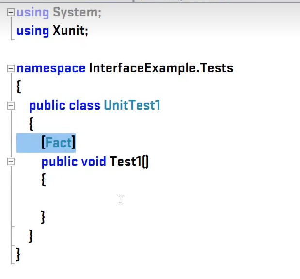
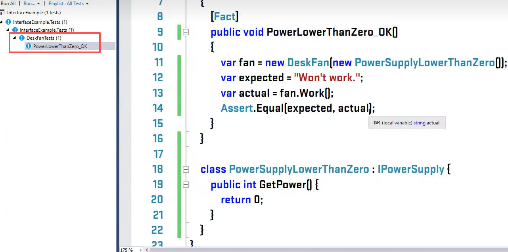
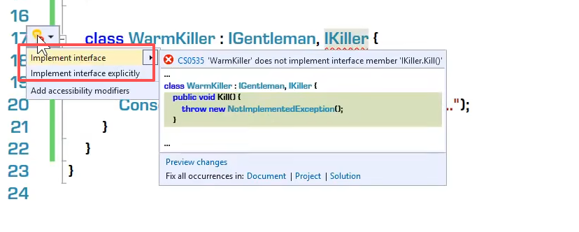
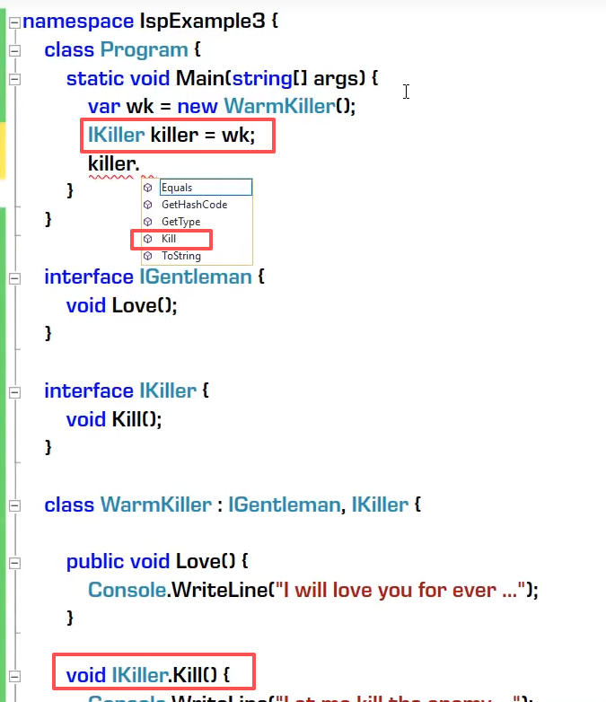

## 接口与单元测试
- 当某一个抽象类的成员都是抽象方法，那么这个抽象类就是接口：将public abstract 替换为interface即可。由于接口内部所有的抽象方法都默认为public，所以在接口内部不写public.和abstract，又因为没有了abstract关键字，所以在实现接口的时候，也不可以写override关键字。接口名称用I开头。
``` c#
abstract class Student
{
    abstract public void Study();
}


interface IStudent()
{
  void Study();
}
```

- 接口
  - 
  - 接口是**完全未实现**逻辑的“类”（“纯虚类”；只有函数成员；成员全部public）
  - 接口为解耦而生：“高内聚，低耦合”，方便单元测试
  - 接口是一个“协约”，早已为工业生产所熟知（有分工必有协作，有协作必有协约）
  - 接口和抽象类都不能实例化，只能用来声明变量、引用具体类（concrete class）的实例
- 接口与单元测试
  - 接口的缠上：自底向上（重构），自顶向下（设计）
  - C#中接口的实现（隐式，显式，多借口）
  - 语言对面向对象设计的内建支持：依赖反转，接口隔离，开/闭原则……





依赖反转：当有多个一个类依赖另一个类紧时，在他们之中找到更抽象的类成为接口，让这多个类实现这个接口，依赖关系从一对一到多对一。并且让这些类依赖于更抽象的接口。依赖关系从往下变上。
当类实现一个接口的时候，类与接口之间的关系也式紧耦合。



## 单元测试：添加对应项目的测试项目。推荐xUnit.
项目名称为：项目名称.Tests

- 先引入要测试的项目。

``` c#

[Fact]
public void PowerLowerThanZero_OK()
{
  var fan = new DeskFan(new PowerSupplyLowerThanZero());
  var expected = "Won't work";
  var actual = fan.Work();
  Assert.Equal(expected,actual);
}

class PowerSupplyLowerThanZero:IPowerSupply
{
  public int GetPower()
  {
    return 0;
  }
}
```


左侧的测试图标颜色变绿，为通过，变红则不通过。

Moq测试:mock测试简化单元测试，不用创建很多的类。
右键点击项目->Nuget->"Moq"->安装
使用方法：

``` c#
using moq;
var mock = new Mock<IPowerSupply>();
mock.Setup(ps=>ps.GetPower()).Returns(()=>0);  
var fan = new DeskFan(new PowerSupplyLowerThanZero(mock.Object));
```
 ## 单一原则
一个接口只实现一个或者一类功能，比如坦克类与汽车类。汽车类中有驾驶的方法。坦克有武器系统。想要给他们合成一个接口需要将坦克分为武器和开火两个接口。

坦克继承武器和驾驶两个接口。
汽车只继承驾驶这个接口。

## 接口的显式实现

- 一个类可以实现多个接口，但有的时候，部分接口不想让人轻易调用，这个时候就需要显式接口实现，将需要让人调用的接口显式实现。
- 
  - Implement interface：隐式实现
  - Implement interface explicity
  - void 要实现的接口名.要实现的接口方法（）{}，也就意味着，只有用该接口的类型才可以调用这个方法，就实现了接口隔离。
  - ，此时调用不到隐式实现的接口方法，可以进行类型转换来调用。