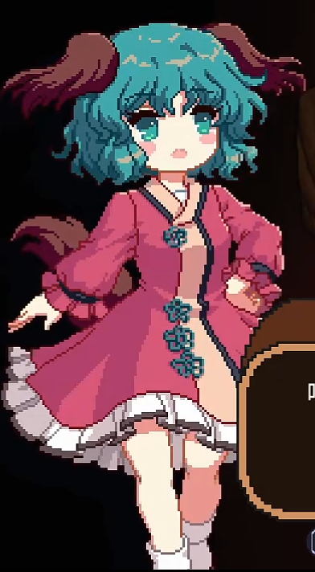
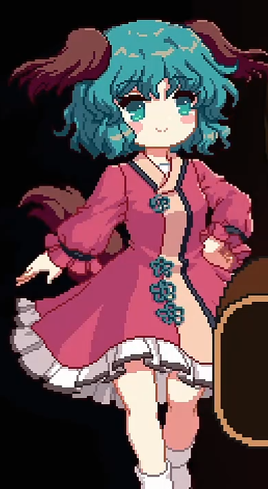
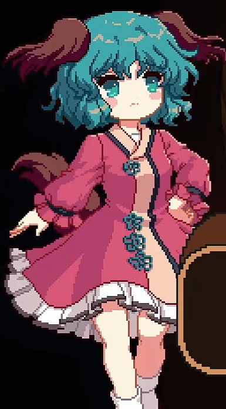
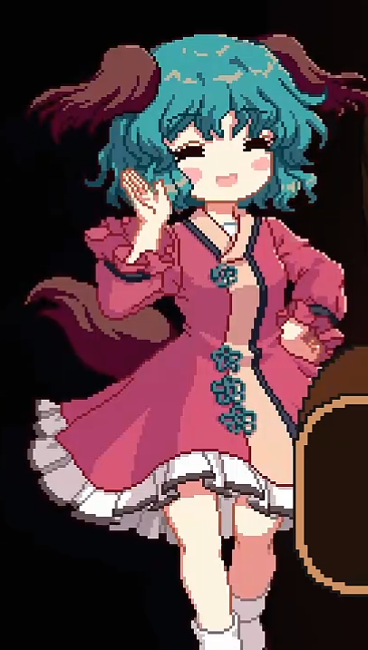
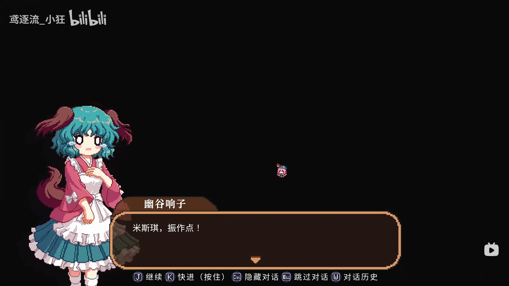

<section id="Img">
<h2>小碎骨图像资源</h2>
<ul>
<li> 张嘴 </li>
<li> 小碎骨惊讶 </li>
<li> 小碎骨睁眼 </li>
<li> 小碎骨闭眼笑 </li>
<li> 小碎骨头晕 </li>
<li> 小碎骨惊讶 </li>
<li> 小碎骨犯困 </li>
</ul>
</section>

<a href="../Index.md">返回角色图鉴</a>