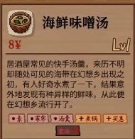
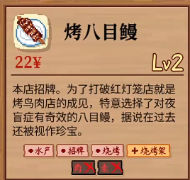

**logo**:

**名称**：海鲜味增汤
**价格**：8￥
**等级**：Lv1
**描述**：居酒屋常见的快手汤羹，来历不明却随处可见的海带在幻想乡出现之初，有人好奇水煮了一下，结果意外地发现有种异样的鲜味，从此便在幻想乡流行开了。
**标签**：素，家常，汤羹
**排斥标签**：重油
**附加标签**：煮锅，实惠
**所需食材**：[海苔](../ingredients/ingredients.md#海苔)

**logo**:

**名称**：海鲜味增汤
**价格**：8￥
**等级**：Lv1
**描述**：居酒屋常见的快手汤羹，来历不明却随处可见的海带在幻想乡出现之初，有人好奇水煮了一下，结果意外地发现有种异样的鲜味，从此便在幻想乡流行开了。
**标签**：素，家常，汤羹
**排斥标签**：重油
**附加标签**：煮锅，实惠
**所需食材**：[海苔](../ingredients/ingredients.md#海苔)

