1月2日

- section 1
出场人物：**米斯蒂娅**，**幽谷响子**，**橙**

>**米斯蒂娅**：唔……唔……
>**米斯蒂娅**：不、不要--！
>**米斯蒂娅**：……
>**米斯蒂娅**：做了个奇怪的梦呢……
>**米斯蒂娅**：……话说真的是梦吧？感觉有点真实呢。
>**米斯蒂娅**：梦里面好像还出现了些什么人……不行，想不起来……
>**米斯蒂娅**：什么啊，莫名其妙的。
>**米斯蒂娅**：咦，我手上怎么攥了个银杏的叶子？是睡着的时候飘进来的嘛？
>**米斯蒂娅**：……总感觉好像是什么很重要的东西，为什么呢？
>**米斯蒂娅**：……
>**米斯蒂娅**：算了！想不起来的事情就不要白费功夫去想了，谁叫我是鸟脑袋呢~
>**米斯蒂娅**：哎呀--睡得真饱！我以后也能开到像梦里那么大的店就好了呢！啊，可是最后好像是被谁破坏了来着……
>**米斯蒂娅**：…………
>**米斯蒂娅**：哎呀，还是别瞎想了，赶紧来准备今晚额度营业吧~

- section2
  
>**米斯蒂娅**：我的名字叫做米斯蒂娅！是这个名为幻想乡的奇妙世界里随处可见的、弱小的妖怪。
>**米斯蒂娅**：我最喜欢--的事情是唱歌和烤八目鳗，现在凭着兴趣经营者一家名为雀酒屋的小摊铺
>**米斯蒂娅**：……唱歌姑且不提，把烤八目鳗作为兴趣很奇怪？
>**米斯蒂娅**：--什么啊！难道就必须要做烤鸟肉吗！？这样的设定才奇怪呢！
>**米斯蒂娅**：八目鳗在过去可是被视作珍宝的哦，这才是更加好吃的食物吧！
>**米斯蒂娅**：而且还可以预防夜盲症，这是双重的美味和生意哦，简直太完美了！今天的我也干劲满满呢！

- section3

>**米斯蒂娅**：……
>**米斯蒂娅**：前面好像发生了什么事--
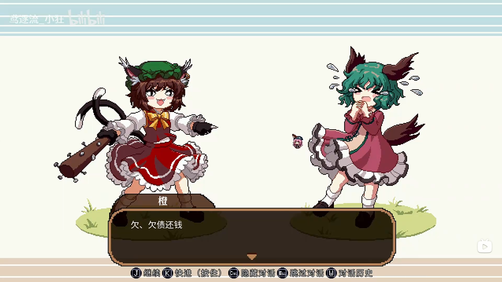
>**橙**：欠、欠债还钱，你少装出这种可怜的样子，我……
>**橙**：我才不会同情你！
>**幽谷响子**：呜呜，我不是不还钱，只是这个利息实在太高了，我真的……
>**幽谷响子**：拜托了！请再宽限我一点时间吧，我一定会努力去筹钱的！

>**橙**：我……不想！我、我才不管！
>**橙**：总之今天已经到时间了，你还不上钱，就别怪我……唔……
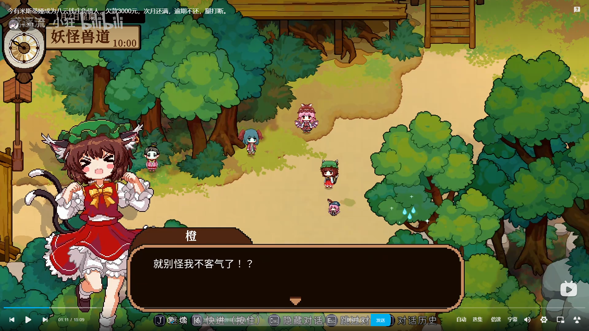
>**橙**：就别怪我不客气了！？
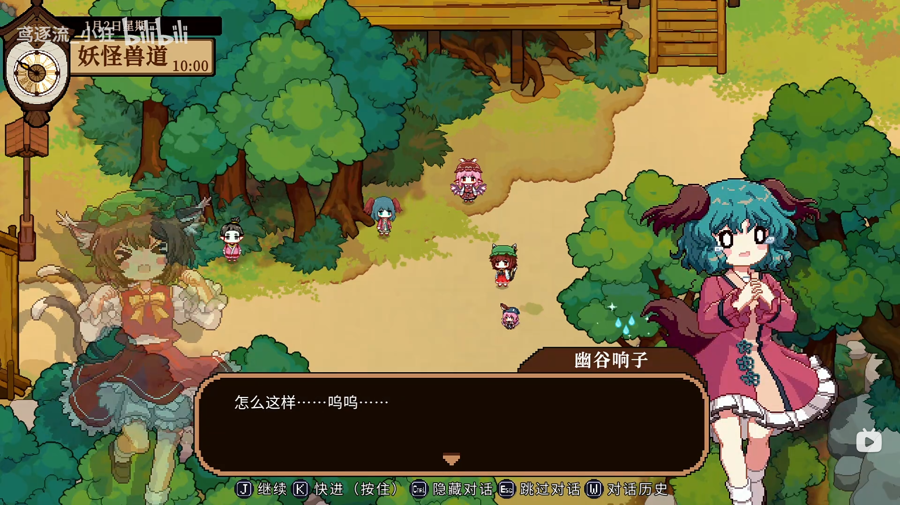
>**幽谷响子**：怎么这样……呜呜……
>**米斯蒂娅**：在是不是响子吗！？
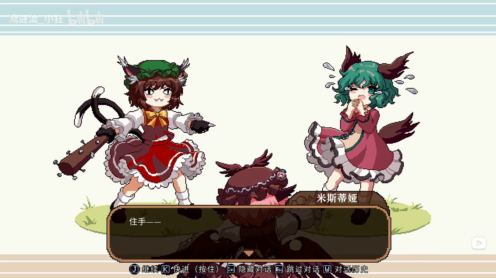
>**米斯蒂娅**：住手——
>**幽谷响子**：米斯琪？
>**米斯蒂娅**：：响子！你没事吧！
>**幽谷响子**：我……
>**橙**：她欠了我们家的钱，我来讨债，你、少管闲事！
>**米斯蒂娅**：响子是我的朋友，她的事就是我的事！
>**幽谷响子**：米斯琪……
>**橙**：好哇，既然这样，那你能替她把钱还了吗？
>**米斯蒂娅**：没问题，你说多少钱吧！我替她还了！
>**幽谷响子**：不，我一人做事一人当！
>**幽谷响子**：米斯琪，这件事不关你的事！你别小看她，不要傻乎乎地把自己牵扯进来！
>**米斯蒂娅**：没事的，就你还能欠多少钱呀！
>**米斯蒂娅**：我好歹也是在做生意，存款什么的还是有一些的啦！交给我吧~
>**米斯蒂娅**：说吧，她欠你多少钱了？
>**橙**：真是爽快！也不多，连本带利也就3000块钱吧~
>**米斯蒂娅**：……
>**米斯蒂娅**：怎、怎么会这么多……
>**幽谷响子**：本身是没有那么多的，但是利息越滚越大，就……
>**米斯蒂娅**：可恶……
>**橙**：什、什么啊，不是你说会帮她还钱的吗！
>**米斯蒂娅**：我……我现在也……
>**橙**：什么嘛，原来是说大话啊~
 >**米斯蒂娅**：唔……
 >**幽谷响子**：米斯琪，没关系的……
 >**幽谷响子**：你有这份心，我已经很高兴了！
 >**幽谷响子**：钱是我一时糊涂欠下的，就让我自己来承担吧！
 >**米斯蒂娅**：你要怎么承担啊……
 >**米斯蒂娅**：能不能……再宽限些时间……
 >**橙**：不行！说了今天还就必须还！
 >**米斯蒂娅**：……
 >**米斯蒂娅**：那这样呢，我也向你们借一笔钱，用来还响子的债……
 >**幽谷响子**：不行！这样不就让你负债了吗！雪球只会越滚越大，根本就无法解决！
 >**米斯蒂娅**：眼下也没有别的办法了……
 >**米斯蒂娅**：别担心，我也算是有自己的事业呀，还是有拼一拼的资本的！
 >**幽谷响子**：可是……
 >**米斯蒂娅**：管不了那么多了！
 >**米斯蒂娅**：怎么样，你再怎么逼她，她也不可能还上钱，还是我的办法对你们比较有利吧！
 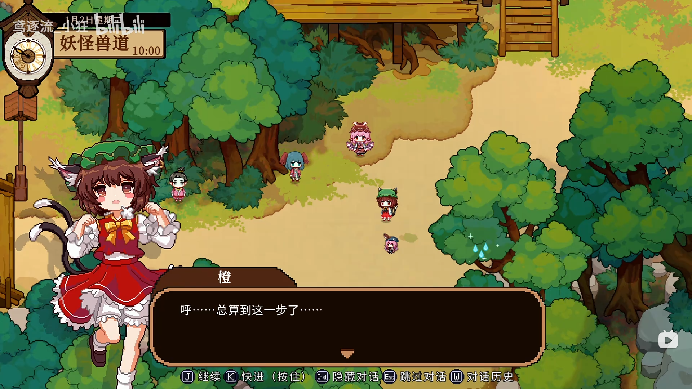
 >**橙**：呼……总算到这一步了……
 >**米斯蒂娅**：你说什么？
 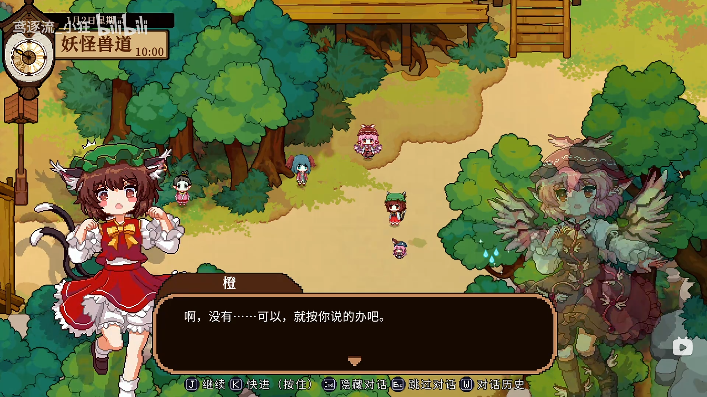
 > **橙**：啊，没有……可以，就按你说的办吧。
  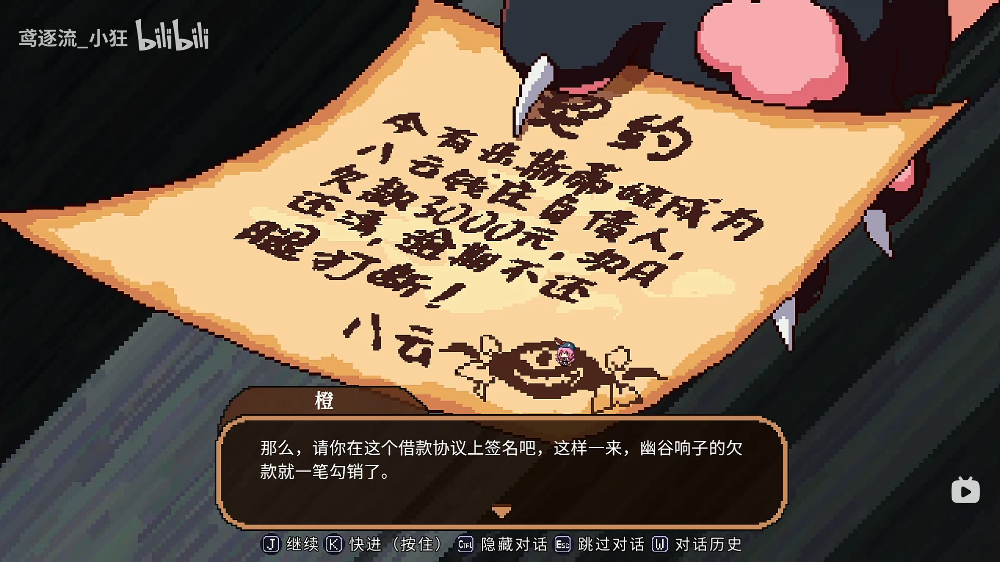
  >  **橙**：那么，请你在这个借款协议上签名吧，这样一来，幽谷响子的欠款就一笔勾销了。
  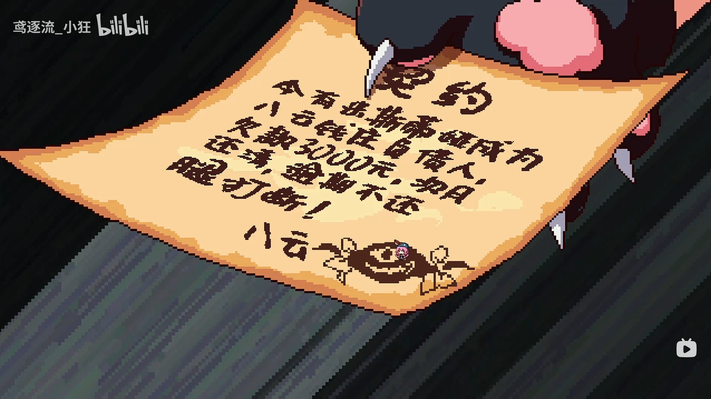
>  **米斯蒂娅**：咦，事先就准备好了借款协议了吗……
>  **橙**：这、这你就别管了，快点签吧！
> **米斯蒂娅**：唔……但是……
> **橙**：怎、怎么，你该不会反悔了吧！？
> **米斯蒂娅**：不是……我……我不识字
> **橙**：……
> **幽谷响子**：……
> **橙**：盖个手印也行！
> 
> **米斯蒂娅**：好、好的……
> 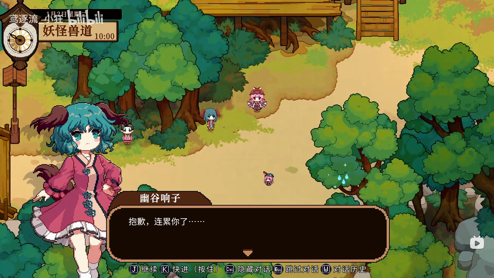
> **幽谷响子**：抱歉，连累你了……
> **米斯蒂娅**：说什么呢，我们不是好朋友吗！
> **幽谷响子**：我不能让你一个人背负这一切，无论如何，也让我来帮忙吧！
> 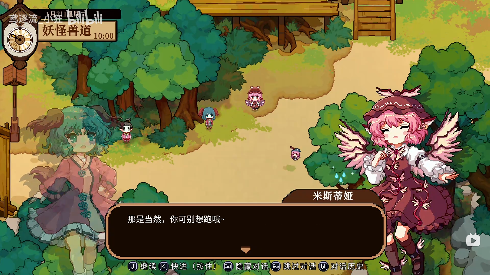
> **米斯蒂娅**：那是当然，你可别想跑哦~
> **幽谷响子**：是！！！
> 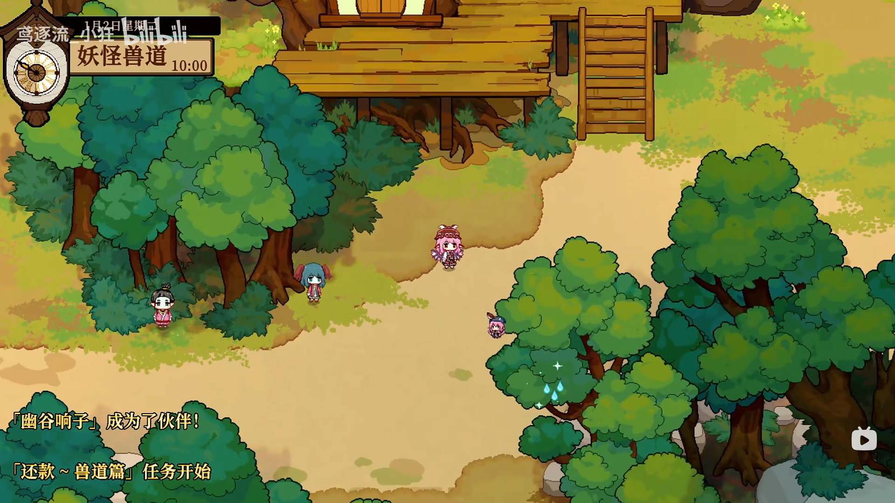