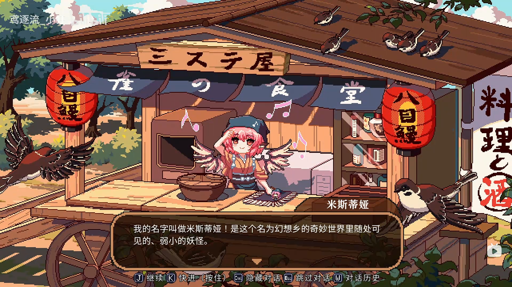
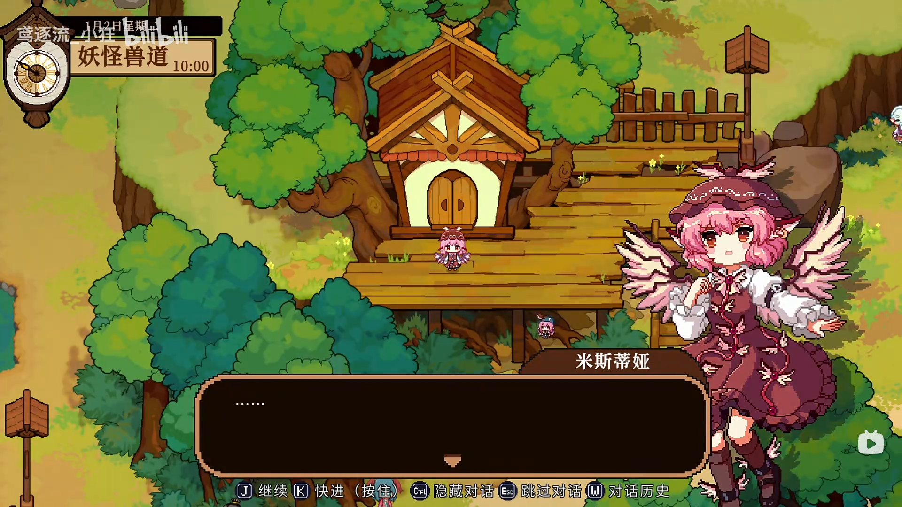

1月2日

- section 1
出场人物：**米斯蒂娅**，**幽谷响子**，**橙**

>**米斯蒂娅**：唔……唔……
>**米斯蒂娅**：不、不要--！
>**米斯蒂娅**：……
>**米斯蒂娅**：做了个奇怪的梦呢……
>**米斯蒂娅**：……话说真的是梦吧？感觉有点真实呢。
>**米斯蒂娅**：梦里面好像还出现了些什么人……不行，想不起来……
>**米斯蒂娅**：什么啊，莫名其妙的。
>**米斯蒂娅**：咦，我手上怎么攥了个银杏的叶子？是睡着的时候飘进来的嘛？
>**米斯蒂娅**：……总感觉好像是什么很重要的东西，为什么呢？
>**米斯蒂娅**：……
>**米斯蒂娅**：算了！想不起来的事情就不要白费功夫去想了，谁叫我是鸟脑袋呢~
>**米斯蒂娅**：哎呀--睡得真饱！我以后也能开到像梦里那么大的店就好了呢！啊，可是最后好像是被谁破坏了来着……
>**米斯蒂娅**：…………
>**米斯蒂娅**：哎呀，还是别瞎想了，赶紧来准备今晚额度营业吧~

- section2
  
>**米斯蒂娅**：我的名字叫做米斯蒂娅！是这个名为幻想乡的奇妙世界里随处可见的、弱小的妖怪。
>**米斯蒂娅**：我最喜欢--的事情是唱歌和烤八目鳗，现在凭着兴趣经营者一家名为雀酒屋的小摊铺
>**米斯蒂娅**：……唱歌姑且不提，把烤八目鳗作为兴趣很奇怪？
>**米斯蒂娅**：--什么啊！难道就必须要做烤鸟肉吗！？这样的设定才奇怪呢！
>**米斯蒂娅**：八目鳗在过去可是被视作珍宝的哦，这才是更加好吃的食物吧！
>**米斯蒂娅**：而且还可以预防夜盲症，这是双重的美味和生意哦，简直太完美了！今天的我也干劲满满呢！

- section3

>**米斯蒂娅**：……
>**米斯蒂娅**：前面好像发生了什么事--