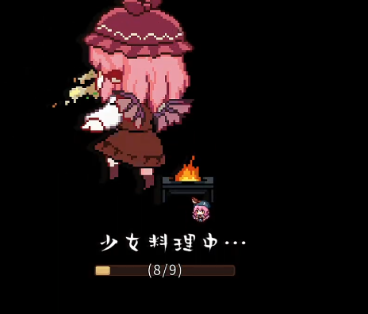

# 东方夜雀食堂--剧情wiki

## 是否要跳过序幕剧情 -- 是

 ## 出场人物：
 - [米斯蒂娅](../../characters/Mystia/Mystia.md)
 - [幽谷响子](../../characters/Kyouko/Kyouko.md)
 - [西行寺幽幽子]
 - [上白泽慧音]

### section A

> **米斯蒂娅**：哈~
> **米斯蒂娅**：睡了个不错的觉，差不多要开始为今晚的营业做准备了呢。
> **米斯蒂娅**：咦，她还没来吗？
> **幽谷响子** 呼……呼……
> **米斯蒂娅**：怎、怎么了，先喝杯水休息一下吧。
> **幽谷响子**：啊，没事，只是一路跑过来所以有点喘……
> **幽谷响子**：抱歉啊，我又迟到了。今天风比较大，[住持](#)要我把落叶全部扫完才能走，呜呜
> **米斯蒂娅**：哇，辛苦了。要不你就先休息一下吧？我先开始准备好了
> **幽谷响子**：没事，我可以的！请让我一起来帮忙吧！
> **米斯蒂娅**：真的没事吗？勉强哦……
> **幽谷响子**：没事啦！而且今晚是……决胜之夜啊，我怎么能在这种时候离开你呢！
> **米斯蒂娅**：响子，谢谢你……
> **米斯蒂娅**：好！那我们就开始准备今晚的食材吧！
> 少女料理中……
> 

### section B

>

> **??????** ：饿--
> **米斯蒂娅**：来了！就是她吗！？
> **??????** ：饿--
> **幽谷响子**：米斯琪，她的样子看起来有点奇怪。
> **米斯蒂娅**：大家好不容易拜托给我的事，要是搞砸的话……
> **幽谷响子**：米斯琪……
> **??????** ：我好饿啊--
> **米斯蒂娅**：……
> **幽谷响子**：……
> **米斯蒂娅**：不管她再怎么可怕，现在也只是一个饿肚子的客人而已！
> **米斯蒂娅**：既然是我的客人，那我该做的事就只有一件。
> **米斯蒂娅**：让客人的胃得到满足，就是我站在这里的意义！
> **幽谷响子**：说的没错！我、我也不会退缩的！
> **幽谷响子**：这位客人，这是菜单--
> **幽谷响子**：你想吃什么都可以，我们今天可是有备而来的！请随便下单吧~
> **??????** ：……
> **??????** ：……味增汤
> **米斯蒂娅**：好，包在我身上！
