# 东方夜雀食堂--剧情wiki

## 是否要跳过序幕剧情 -- 是

 ## 出场人物：
 - [米斯蒂娅](../../characters/Mystia/Mystia.md)
 - [幽谷响子](../../characters/Kyouko/Kyouko.md)
 - [西行寺幽幽子](../../Characters/Saigyouji%20Yuyuko/Saigyouji%20Yuyuko.md)
 - [上白泽慧音](../../Characters/Kamishirasawa%20Keine/Kamishirasawa%20Keine.md)

### section A

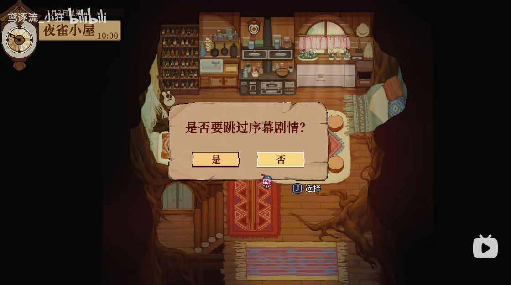

> **米斯蒂娅**：哈~
> **米斯蒂娅**：睡了个不错的觉，差不多要开始为今晚的营业做准备了呢。
> **米斯蒂娅**：咦，她还没来吗？
> **幽谷响子** 呼……呼……
> **米斯蒂娅**：怎、怎么了，先喝杯水休息一下吧。
> **幽谷响子**：啊，没事，只是一路跑过来所以有点喘……
> **幽谷响子**：抱歉啊，我又迟到了。今天风比较大，[住持](#)要我把落叶全部扫完才能走，呜呜
> **米斯蒂娅**：哇，辛苦了。要不你就先休息一下吧？我先开始准备好了
> **幽谷响子**：没事，我可以的！请让我一起来帮忙吧！
> **米斯蒂娅**：真的没事吗？勉强哦……
> **幽谷响子**：没事啦！而且今晚是……决胜之夜啊，我怎么能在这种时候离开你呢！
> **米斯蒂娅**：响子，谢谢你……
> **米斯蒂娅**：好！那我们就开始准备今晚的食材吧！
> 少女料理中……
> 

### section B

>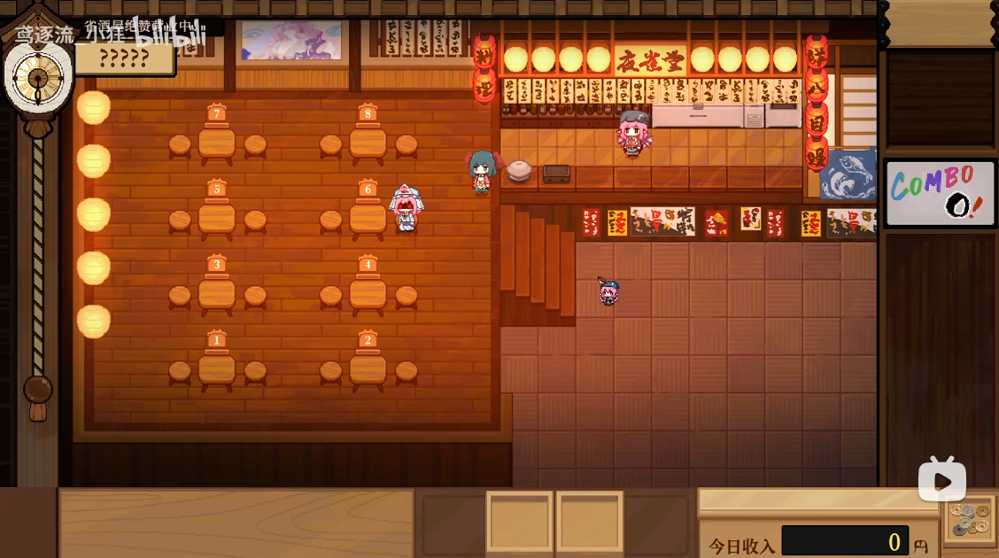

> **??????** ：饿--
> **米斯蒂娅**：来了！就是她吗！？
> **??????** ：饿--
> **幽谷响子**：米斯琪，她的样子看起来有点奇怪。
> **米斯蒂娅**：大家好不容易拜托给我的事，要是搞砸的话……
> **幽谷响子**：米斯琪……
> **??????** ：我好饿啊--
> **米斯蒂娅**：……
> **幽谷响子**：……
> **米斯蒂娅**：不管她再怎么可怕，现在也只是一个饿肚子的客人而已！
> **米斯蒂娅**：既然是我的客人，那我该做的事就只有一件。
> **米斯蒂娅**：让客人的胃得到满足，就是我站在这里的意义！
> **幽谷响子**：说的没错！我、我也不会退缩的！
> **幽谷响子**：这位客人，这是菜单--
> **幽谷响子**：你想吃什么都可以，我们今天可是有备而来的！请随便下单吧~
> **??????** ：……
> **??????** ：……味增汤
> **米斯蒂娅**：好，包在我身上！
> 
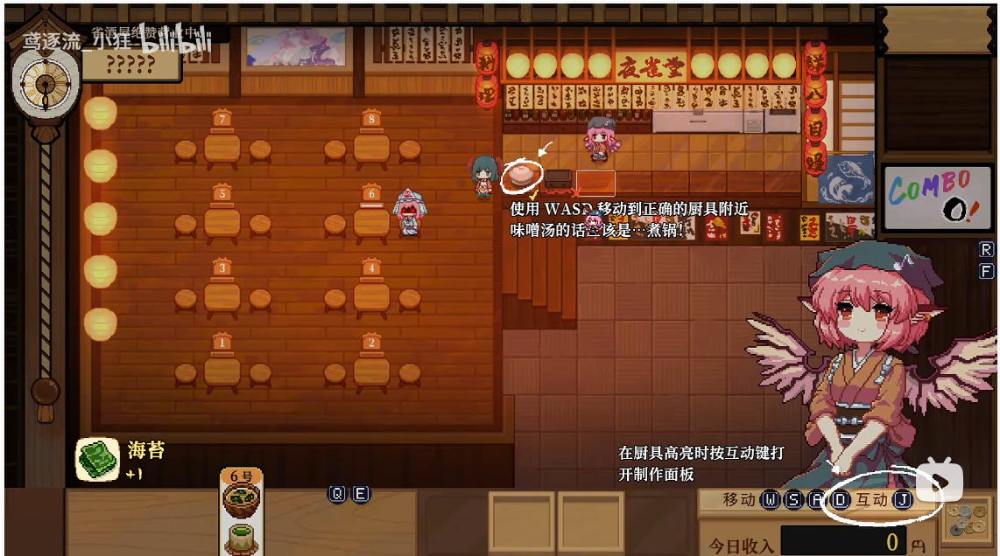
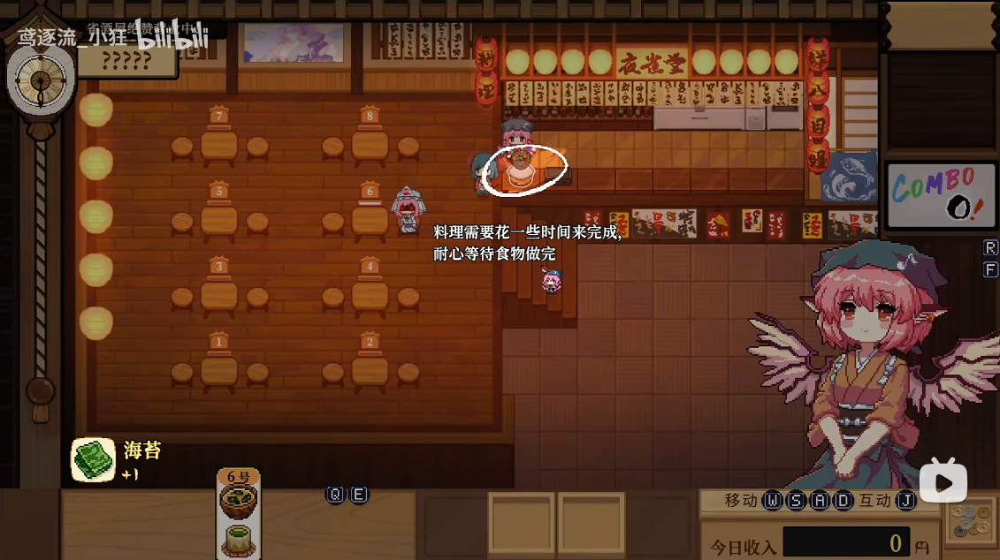
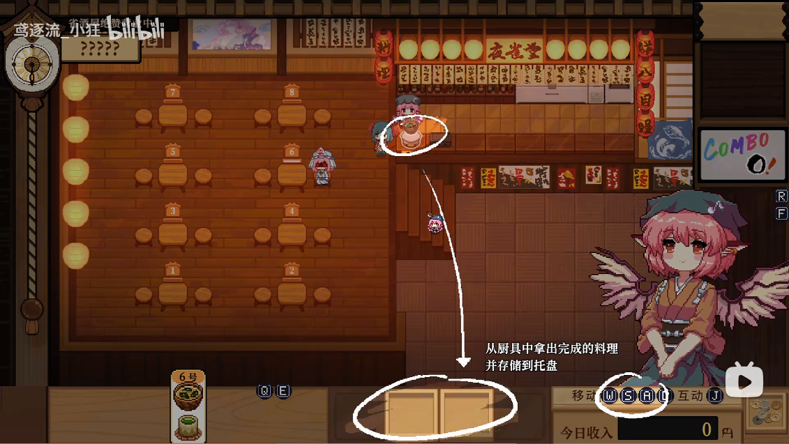
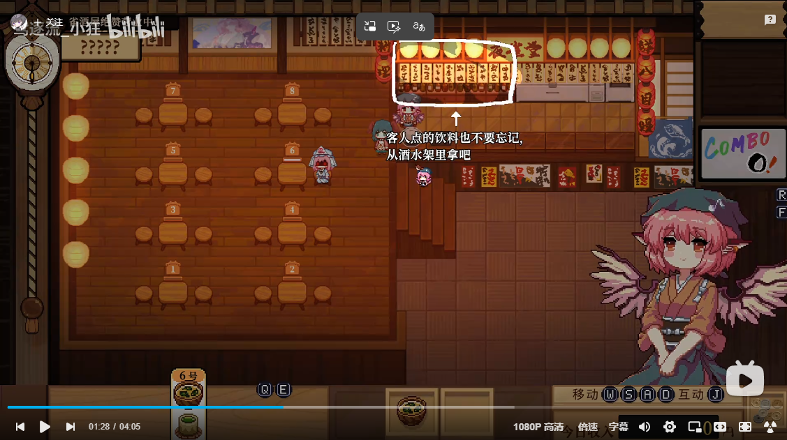
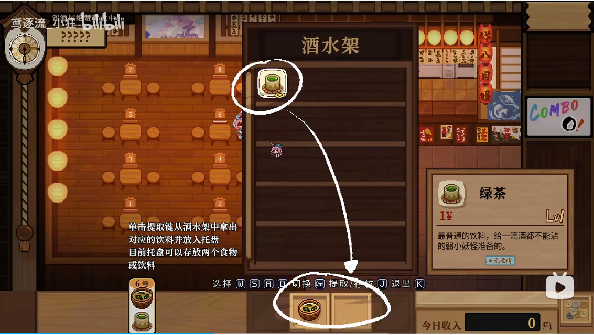
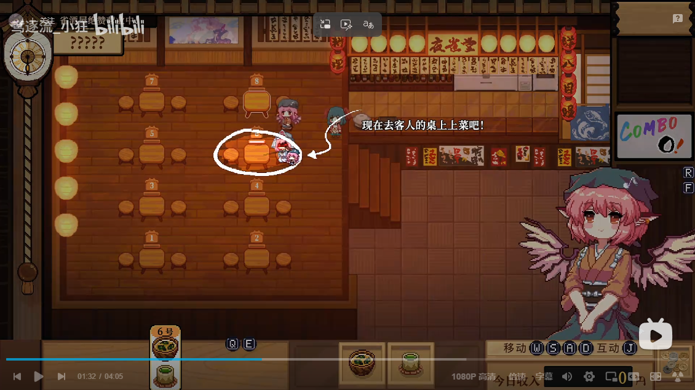
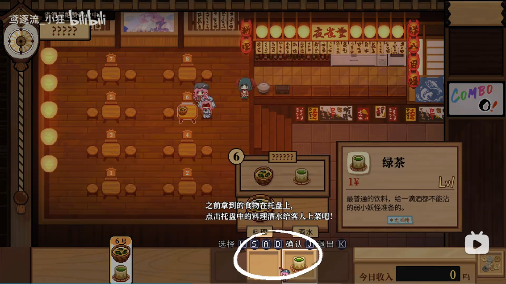
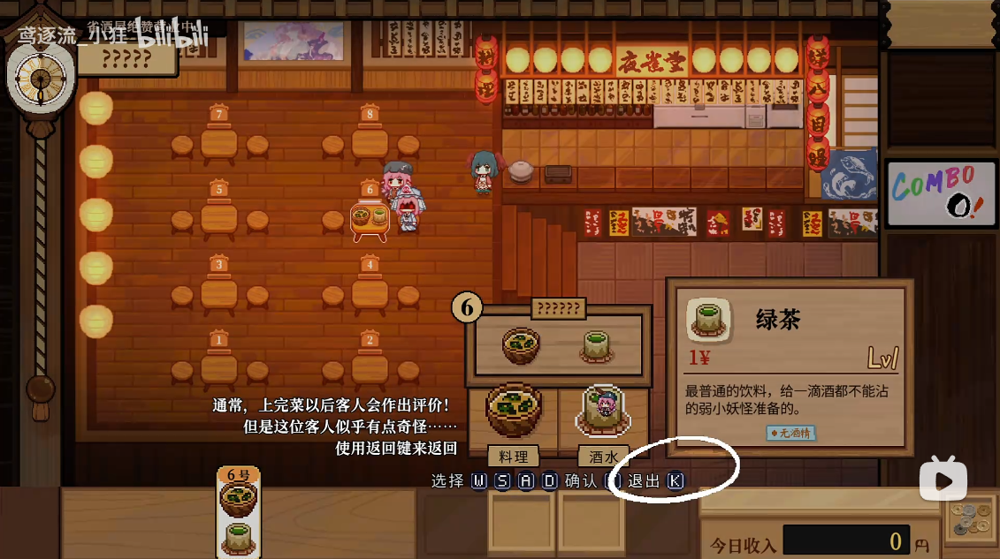

>**米斯蒂娅**:这……这位客人，不知道你喜不喜欢
>**??????** ：[烤八目鳗]()。
>**米斯蒂娅**：……？
>**米斯蒂娅**：（好……好恐怖，居然在端上桌的一瞬间就吃完了）
>**米斯蒂娅**：八目鳗可是我加的招牌菜，我这就去准备！

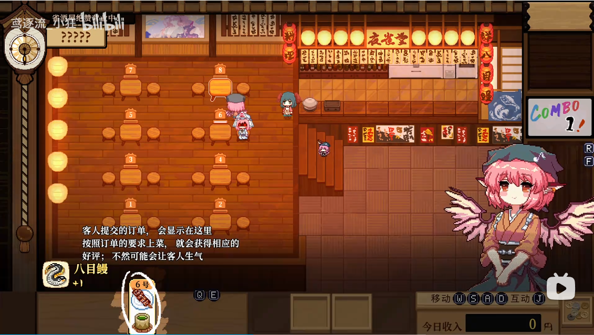

>**??????** ：[能量串]()。
>**米斯蒂娅**：（拼命睁大眼睛才捕捉倒一丝残影，这就是超越常识的力量吗……）
>**米斯蒂娅**：看……看来真的是饿坏了呢，马上就来！
>**??????** ：[大奢宴]()。
>**米斯蒂娅**：（果然又是立刻就吃完了）
>**米斯蒂娅**：好，马上到！
>**??????** ：[刺身拼盘]()。
>**米斯蒂娅**：欸！？
>**??????** ：[惠灵顿牛排]()。
>**米斯蒂娅**：客人，一次点这么多我也没法……
>**??????** ：[猪鹿蝶]()。
>**米斯蒂娅**：客人？
>**??????** ：……
>**米斯蒂娅**：你要做什……
> **幽谷响子**：米斯琪快闪开！
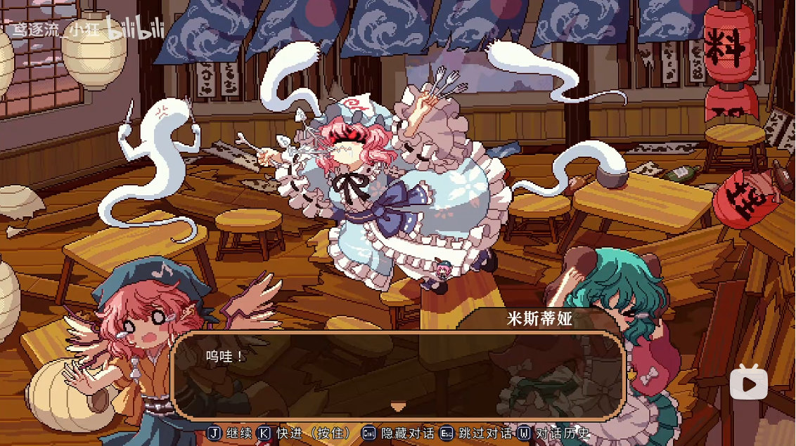

> **米斯蒂娅**：呜哇！
> **??????** ：吃掉……全部……吃掉！
> **米斯蒂娅** ：怎、怎么会这样
> **幽谷响子**：米斯琪，振作点！
> **米斯蒂娅** ：什么、又回来了吗！？
> **幽谷响子**：不，你看清楚，这不是刚刚那位！

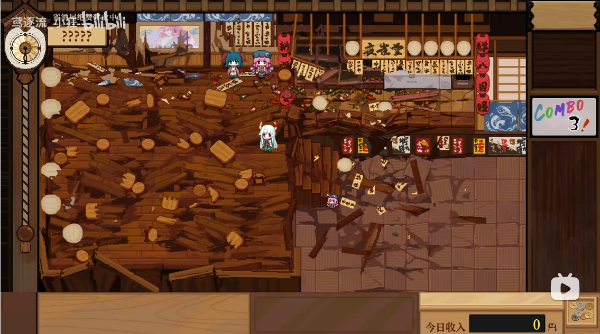

> **?????**：果然还是不行吗……
> **幽谷响子**：米斯琪，这位客人好像在哪里见过？
> **米斯蒂娅** ：……？
> **米斯蒂娅** ：啊！您、您是！
> **米斯蒂娅** ：我、我搞砸了啊，好不容易……积累起来的这一切都……
> **米斯蒂娅** ：幻想乡和大家也……对不起……我……
> **?????**：……
> **?????**：这一次还是不行吗……这个任务对你来说仍然太过艰巨
> **?????**：很抱歉，但是只有你可以……
> **?????**：我只想问你，你要就这样放弃吗？
> **米斯蒂娅** ：我……
> **米斯蒂娅** ：……
> **米斯蒂娅** ：可是。我已经什么都没有了……
> **幽谷响子**：米斯琪……
> **?????**：本来。现在说什么都没有意义，因为已经太晚了。
> **?????**：但是有我和那个人的能力的话，一切还有回转的余地……
> **米斯蒂娅** ：你说什么！？
> **?????**：我是吞噬历史的半兽，只要有我在，无论多少次，都可以重新开始。
> **?????**：只要你心有不甘，无论多少次，我都愿意助你一臂之力。
> **米斯蒂娅** ：……
> **米斯蒂娅** ：大家新来者我，把一切都托福给我……
> **米斯蒂娅** ：我不甘心……我不想放弃！绝对不要就这样结束！
> **?????**：果然，无论多少次，你都会做出一样的选择。
> **米斯蒂娅** ：诶？
> **?????**：没错，选择就放弃还太早了。
> **?????**：重生之路纵然艰辛，也只有坚定地前行。
> **?????**：这个信物，将来或许会对你有帮助，你务必妥善收好。

> **米斯蒂娅** ：这是……唔，意识怎么……
> **?????**：希望历史的齿轮这次能够一直转动下去……
> **?????**：你是幻想乡的希望
> **?????**：我……不，我们。我们唯有将希望赌在你身上了。
> >

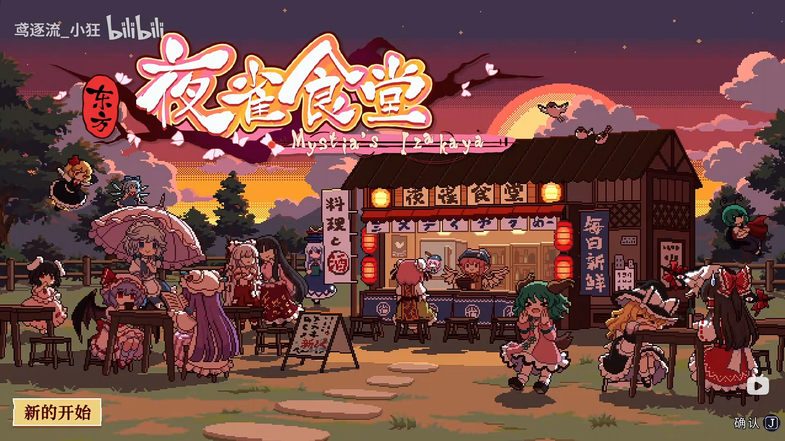
